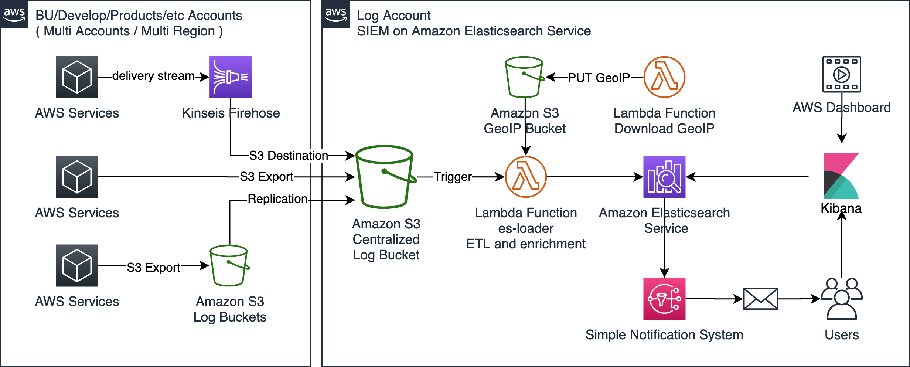

# SIEM on Amazon Elasticsearch Service

[View this page in Japanese (日本語)](README_ja.md) | [Chinese (中文)](README_zh.md)

SIEM on Amazon Elasticsearch Service (Amazon ES) is a solution for collecting multiple types of logs from multiple AWS accounts, correlating and visualizing the logs to help investigate security incidents. Deployment is easily done with the help of AWS CloudFormation or AWS Cloud Development Kit (AWS CDK), taking only about 30 minutes to complete. As soon as AWS services logs are put into a specified Amazon Simple Storage Service (Amazon S3) bucket, a purpose-built AWS Lambda function automatically loads those logs into SIEM on Amazon ES, enabling you to view visualized logs in the dashboard and correlate multiple logs to investigate security incidents.

Jump to | [Configuring AWS Services(Log Sources)](docs/configure_aws_service.md) | [Changing Configurations of SIEM on Amazon ES](docs/configure_siem.md) | [Advanced Deployment](docs/deployment.md) | [Dashboard](docs/dashboard.md) | [Supported Log Types](docs/suppoted_log_type.md) | [FAQ](docs/faq.md) | [Changelog](CHANGELOG.md) |


## Architecture



## Supported Log Types

SIEM on Amazon ES can load and correlate the following log types.

|       |AWS Service|Log|
|-------|-----------|---|
|Security, Identity, & Compliance|Amazon GuardDuty|GuardDuty findings|
|Security, Identity, & Compliance|AWS Directory Service|Microsoft AD|
|Security, Identity, & Compliance|AWS WAF|AWS WAF Web ACL traffic information<br>AWS WAF Classic Web ACL traffic information|
|Security, Identity, & Compliance|AWS Security Hub|Security Hub findings<br>GuardDuty findings<br>Amazon Macie findings<br>Amazon Inspector findings<br>AWS IAM Access Analyzer findings|
|Security, Identity, & Compliance|AWS Network Firewall|Flow logs<br>Alert logs|
|Management & Governance|AWS CloudTrail|CloudTrail Log Event<br>CloudTrail Insight Event|
|Networking & Content Delivery|Amazon CloudFront|Standard access log<br>Real-time log|
|Networking & Content Delivery|Amazon Route 53 Resolver|VPC DNS query log|
|Networking & Content Delivery|Amazon Virtual Private Cloud (Amazon VPC)|VPC Flow Logs (Version5)|
|Networking & Content Delivery|Elastic Load Balancing|Application Load Balancer access logs<br>Network Load Balancer access logs<br>Classic Load Balancer access logs|
|Storage|Amazon FSx for Windows File Server|audit log|
|Storage|Amazon Simple Storage Service (Amazon S3)|access log|
|Database|Amazon Relational Database Service (Amazon RDS)<br>(**Experimental Support**)|Amazon Aurora(MySQL)<br>Amazon Aurora(PostgreSQL)<br>Amazon RDS for MariaDB<br>Amazon RDS for MySQL<br>Amazon RDS for PostgreSQL|
|Analytics|Amazon Managed Streaming for Apache Kafka (Amazon MSK)|Broker log|
|Compute|Linux OS<br>via CloudWatch Logs|/var/log/messages<br>/var/log/secure|
|Compute|Windows Servver 2012/2016/2019<br>via CloudWatch Logs|System event log<br>Security event log|
|Containers|Amazon Elastic Container Service (Amazon ECS)<br>via FireLens|Framework only|
|End User Computing|Amazon WorkSpaces|Enventory<br>Event log|

Experimental Support: We may change field type, normalization and something in the future.

Supported logs are normalized in accordance with the [Elastic Common Schema](https://www.elastic.co/guide/en/ecs/current/index.html). Click [here](docs/suppoted_log_type.md) to see the correspondence table of the original and normalized field names for the logs.

## Dashboard

See [this](docs/dashboard.md)

## Getting Started

In this turorial, you will create a publicly accessible SIEM on Amazon ES domain using a CloudFormation template. See [Advanced Deployment](docs/deployment.md) if you need to deploy it within an Amazon VPC or need to customize it.

You can add country information as well as latitude/longitude location information to each IP address. To get location information, SIEM on Amazon ES downloads and uses GeoLite2 Free by [MaxMind](https://www.maxmind.com). If you want to add location information, get your free licence from MaxMind.

_Note:_ The CloudFormation template will deploy Amazon ES with **a t3.medium.elasticsearch instance. It's not the AWS Free Tier. Change it to an instance type that can deliver higher performance than t2/t3 when using SIEM in the production environment as it requires higher processing power when aggregating many logs.** Use the AWS Management Console to change the instance type, extend the volume, or use UltraWarm. This is because the CloudFormation template for SIEM on Amazon ES is designed for the initial deployment purpose only, and cannot be used for managment purposes like changing/deleting nodes.

### 1. Quick Start

Choose a region where you want to deploy SIEM on Amazon ES from the following: 

| Region | CloudFormation |
|--------|----------------|
| N. Virginia (us-east-1) |[](https://console.aws.amazon.com/cloudformation/home?region=us-east-1#/stacks/new?stackName=aes-siem&templateURL=https://aes-siem-us-east-1.s3.amazonaws.com/siem-on-amazon-elasticsearch.template) |
| Oregon (us-west-2) |[](https://console.aws.amazon.com/cloudformation/home?region=us-west-2#/stacks/new?stackName=aes-siem&templateURL=https://aes-siem-us-west-2.s3.amazonaws.com/siem-on-amazon-elasticsearch.template) |
| Tokyo (ap-northeast-1) |[](https://console.aws.amazon.com/cloudformation/home?region=ap-northeast-1#/stacks/new?stackName=aes-siem&templateURL=https://aes-siem-ap-northeast-1.s3.amazonaws.com/siem-on-amazon-elasticsearch.template) |
| Frankfurt (eu-central-1) |[](https://console.aws.amazon.com/cloudformation/home?region=eu-central-1#/stacks/new?stackName=aes-siem&templateURL=https://aes-siem-eu-central-1.s3.amazonaws.com/siem-on-amazon-elasticsearch.template) |
| London(eu-west-2) |[](https://console.aws.amazon.com/cloudformation/home?region=eu-west-2#/stacks/new?stackName=aes-siem&templateURL=https://aes-siem-eu-west-2.s3.amazonaws.com/siem-on-amazon-elasticsearch.template) |
| Singapore(ap-southeast-1) |[](https://console.aws.amazon.com/cloudformation/home?region=ap-southeast-1#/stacks/new?stackName=aes-siem&templateURL=https://aes-siem-ap-southeast-1.s3.amazonaws.com/siem-on-amazon-elasticsearch.template) |

If your desired region is not listed above, manually choose the template below:

```text
https://aes-siem-<REGION>.s3.amazonaws.com/siem-on-amazon-elasticsearch.template
```

Or you can create your own template by following the steps below. 

### 2. Creating a CloudFormation template

You can skip this if you have already deployed SIEM on Amazon ES using one of the CloudFormation templates in Step 1 above.

#### 2-1. Prerequisites

The following instance and tools need to be in place so that you can create a CloudFormation template:

* AWS CloudShell or Amazon EC2 instance running Amazon Linux 2
  * "Development Tools"
  * Python 3.8
  * Python 3.8 libraries and header files
  * git

Run the following commands if the above tools have not been installed yet:

```shell
sudo yum groups mark install -y "Development Tools"
sudo yum install -y amazon-linux-extras
sudo amazon-linux-extras enable python3.8
sudo yum install -y python38 python38-devel git jq
sudo update-alternatives --install /usr/bin/python3 python3 /usr/bin/python3.8 1
```

#### 2-2. Cloning SIEM on Amazon ES

Clone SIEM on Amazon ES from our GitHub repository:

```shell
cd
git clone https://github.com/aws-samples/siem-on-amazon-elasticsearch.git
```

#### 2-3. Setting up the enviroment variables

```shell
export TEMPLATE_OUTPUT_BUCKET=<YOUR_TEMPLATE_OUTPUT_BUCKET> # Name of the S3 bucket where the template is loaded
export AWS_REGION=<AWS_REGION> # Region where the distribution is deployed
```

##### _Note:_ $TEMPLATE_OUTPUT_BUCKET indicates an S3 bucket name, so create yours beforehand. This bucket will be used to store files distributed for deployment, so it needs to be publicly accessible. The build-s3-dist.sh script (used to create a template) WILL NOT create any S3 bucket.

#### 2-4. Packaging AWS Lambda functions and creating a template

```shell
cd ~/siem-on-amazon-elasticsearch/deployment/cdk-solution-helper/
chmod +x ./step1-build-lambda-pkg.sh && ./step1-build-lambda-pkg.sh && cd ..
chmod +x ./build-s3-dist.sh && ./build-s3-dist.sh $TEMPLATE_OUTPUT_BUCKET
```

#### 2-5. Uploading the deployment assets to your Amazon S3 bucket

```shell
aws s3 cp ./global-s3-assets s3://$TEMPLATE_OUTPUT_BUCKET/ --recursive --acl bucket-owner-full-control
aws s3 cp ./regional-s3-assets s3://$TEMPLATE_OUTPUT_BUCKET/ --recursive --acl bucket-owner-full-control
```

##### _Note:_ To run the commands, you'll need to grant permissions to upload files to the S3 bucket. Also ensure to set the right access policy to the files once they are uploaded.

#### 2-6. Deploying SIEM on Amazon ES

The uploaded template is now stored in `https://s3.amazonaws.com/$TEMPLATE_OUTPUT_BUCKET/siem-on-amazon-elasticsearch.template`. Deploy this template using AWS CloudFormation.

### 3. Configuring Kibana

It will take about 30 mins for the deployment of SIEM on Amazon ES to complete. You can then continue to configure Kibana.

1. Navigate to the AWS CloudFormation console, choose the stack that you've just created, and then choose "Outputs" from the tab menu at the top right. You can find your username, password, and URL for Kibana. Log into Kibana using the credentials.
1. When you login for the first time, [Select your tenant] is displayed. Select [**Global**]. You can use the prepared dashboard etc.
1. You can also select [**Private**] instead of [Global] in [Select your tenant] and customize configuration and dashboard etc. for each user. The following is the procedure for each user. If you select Global, you do not need to set it.
    1. To import Kibana's configuration files such as dashboard, download [saved_objects.zip](https://aes-siem.s3.amazonaws.com/assets/saved_objects.zip). Then unzip the file.
    1. Navigate to the Kibana console. Click on "Stack Management" in the left pane, then choose "Saved Objects" --> "Import" --> "Import". Choose dashboard.ndjson which is contained in the unzipped folder. Then log out and log in again so that the imported configurations take effect.

### 4. Loading logs into Amazon ES

All you need to do to load logs into SIEM on Amazon ES is PUT logs to the S3 Bucket named **aes-siem-<YOUR_AWS_ACCOUNT>-log**. Then the logs will be automatically loaded into SIEM on Amazon ES. See [this](docs/configure_aws_service.md) for detailed instructions on how to output AWS services logs to the S3 bucket.

## Updating SIEM

If you want to update SIEM on Amazon ES to the latest version, upgrade the Amazon ES domain and then update it in the same way as you did for the initial setup (using CloudFormation or AWS CDK.) You can view the changelog of SIEM [here.](CHANGELOG.md)

_note_: **When you update SIEM, Global tenant settings, dashboards, etc. will be overwritten automatically. The configuration files and dashboards used before the update will be backed up to aes-siem-[AWS_Account]-snapshot/saved_objects/ in the S3 bucket, so restore them manually if you want to restore the original settings.**

### Upgrading the Amazon ES domain

Upgrade Amazon ES to version 7.9:

1. Navigate to the [Amazon ES console](https://console.aws.amazon.com/es/home?)
1. Choose domain: [**aes-siem**]
1. Choose [**Actions**] icon, and choose [**Upgrade domain**] from the drop-down menu
1. For "Version to upgrade to", choose [**7.9**] and then choose [**Submit**]

If you completed the initial setup using CloudFormation, move on to the next step. If you completed the initial setup using the AWS CDK, see  
"Updating SIEM with the AWS CDK" section in [Advanced Deployment](docs/deployment.md).

### Updating the CloudFormation stack

You can update the CloudFormation stack by specifying the CloudFormation template below:

```text
https://aes-siem-<REGION>.s3.amazonaws.com/siem-on-amazon-elasticsearch.template
```

1. Navigate to the [CloudFormation console](https://console.aws.amazon.com/cloudformation/home?)
1. Choose stack [**aes-siem**]
1. Choose [**Update**] at the right top on the screen
1. In Update stack, choose the following:
    * Prepare template: [**Replace current template**]
    * Template source: [**Amazon S3 URL**]
    * Amazon S3 URL:
    * Choose [**Next**]
1. Leave all the other settings as default, and continue to click Next to complete.

Updating is now complete.

## Changing Configurations

### Changing the Amazon ES domain resources after deployment

If you want to make changes to the Amazon ES domain itself such as changing the access policy of Amazon ES, changing the instance type, changing the Availability Zone or adding a new one, or changing to UltraWarm, perform the change from the [Amazon ES console](https://console.aws.amazon.com/es/home?) of AWS Management Console.

### Managing the index and customizing SIEM

SIEM on Amazon ES saves logs in the index and rotates it once a month. If you want to change this interval or load logs from non-AWS services, see [this.](docs/configure_siem.md)

## Loading stored logs through batch processing

You can execute es-loader, which is a python script, in the local environment to load past logs stored in the S3 bucket into SIEM on Amazon ES. 

## AWS resources created by the CloudFormation template

Below is the list of AWS resources created by the CloudFormation template. AWS Identity and Access Management (IAM) resources can be found from the AWS Management Console.

|AWS Resource|Resource Name|Purpose|
|------------|----|----|
|Amazon ES 7.X|aes-siem|SIEM itself|
|S3 bucket|aes-siem-[AWS_Account]-log|For collecting logs|
|S3 bucket|aes-siem-[AWS_Account]-snapshot|For capturing manual snapshots of Amazon ES|
|S3 bucket|aes-siem-[AWS_Account]-geo|For storing downloaded GeoIPs|
|Lambda function|aes-siem-es-loader|For normalizing logs and loading them into Amazon ES|
|Lambda function|aes-siem-deploy-aes|For creating the Amazon ES domain|
|Lambda function|aes-siem-configure-aes|For configuring Amazon ES|
|Lambda function|aes-siem-geoip-downloader|For downloading GeoIPs|
|Lambda function|aes-siem-BucketNotificationsHandler|For configuring invent notification for the S3 bucket that stores logs|
|AWS Key Management Service<br>(AWS KMS) CMK & Alias|aes-siem-key|For encrypting logs|
|Amazon SQS Queue|aes-siem-sqs-splitted-logs|A log is split into multiple parts if it has many lines to process. This is the queue to coordinate it|
|Amazon SQS Queue|aes-siem-dlq|A dead-letter queue used when loading logs into Amazon ES fails|
|CloudWatch Events|aes-siem-CwlRuleLambdaGeoipDownloader| For executing aes-siem-geoip-downloader every day|
|Amazon SNS Topic|aes-siem-alert|This is selected as the destination for alerting in Amazon ES|
|Amazon SNS Subscription|inputd email|This is the email address where alerts are sent|

## Cleanup

1. Navigate to the CloudFormation console and delete stack: aes-siem
1. Delete the following AWS resources manually:
    * Amazon ES domain: aes-siem
    * Amazon S3 bucket: aes-siem-[AWS_Account]-log
    * Amazon S3 bucket: aes-siem-[AWS_Account]-snapshot
    * Amazon S3 bucket: aes-siem-[AWS_Account]-geo
    * AWS KMS customer-managed key: aes-siem-key
        * **Please delete this with care**. After deleting this customer-managed key, you will no longer be able to read logs if they are encrypted using this key.
1. If you deployed SIEM on Amazon ES within an Amazon VPC, delete the following AWS resources as well:
    * Amazon VPC: aes-siem/VpcAesSiem (if you created a new VPC)
    * SecurityGroup: aes-siem-vpc-sg

### If you want to redeploy SIEM on Amazon ES right after deleting it, you need to delete the key alias using the AWS CLI commands below. Otherwise, redeployment will fail as the KMS CMK alias still remains:

```shell
export AWS_DEFAULT_REGION=<AWS_REGION>
aws kms delete-alias  --alias-name  "alias/aes-siem-key"
```

## Security

See [CONTRIBUTING](CONTRIBUTING.md#security-issue-notifications) for more information.

## License

This library is licensed under the MIT-0 License. See the LICENSE file.

This product uses GeoLite2 data created by MaxMind and licensed under [CC BY-SA 4.0](https://creativecommons.org/licenses/by-sa/4.0/), available from [https://www.maxmind.com](https://www.maxmind.com).
