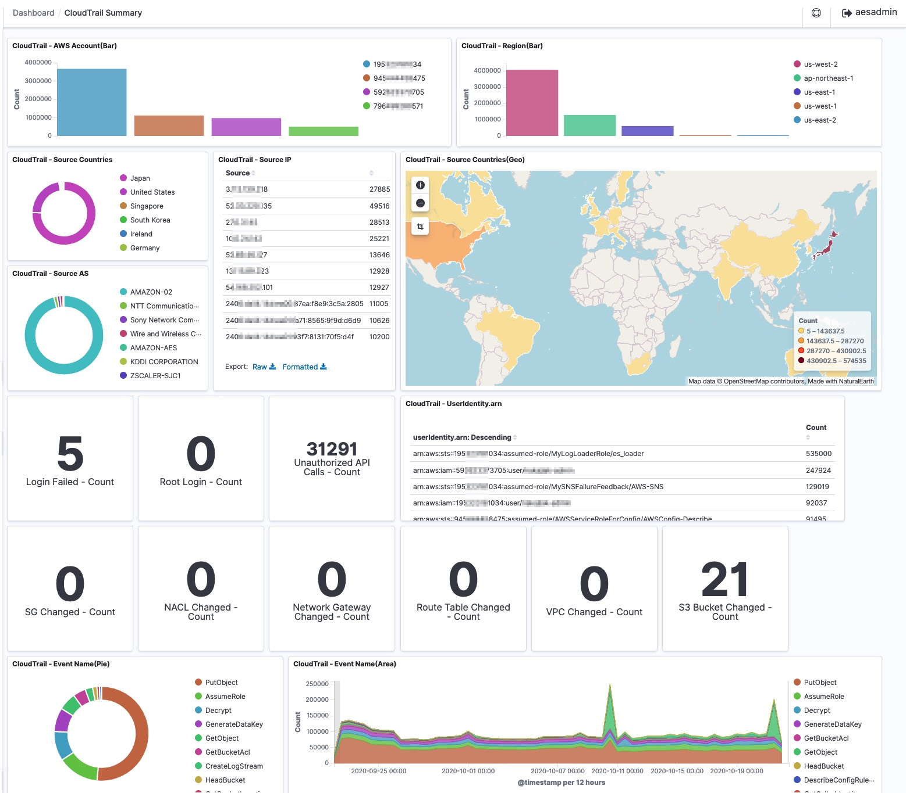

# SIEM on Amazon OpenSearch Service
<!-- markdownlint-disable-file MD026 MD033 -->

[View this page in Japanese (日本語)](README_ja.md) | [Chinese (简体中文)](README_zh-cn.md) | [Chinese (繁體中文)](README_zh-tw.md)

SIEM on Amazon OpenSearch Service is a solution for collecting multiple types of logs from multiple AWS accounts, correlating and visualizing the logs to help investigate security incidents. Deployment is easily done with the help of AWS CloudFormation or AWS Cloud Development Kit (AWS CDK), taking only about 30 minutes to complete. As soon as AWS services logs are put into a specified Amazon Simple Storage Service (Amazon S3) bucket, a purpose-built AWS Lambda function automatically loads those logs into SIEM on OpenSearch Service, enabling you to view visualized logs in the dashboard and correlate multiple logs to investigate security incidents.

Jump to | [Configuring AWS Services(Log Sources)](docs/configure_aws_service.md) | [Changing Configurations of SIEM on OpenSearch Service](docs/configure_siem.md) | [Advanced Deployment](docs/deployment.md) | [Dashboard](docs/dashboard.md) | [Supported Log Types](docs/suppoted_log_type.md) | [FAQ](docs/faq.md) | [Changelog](CHANGELOG.md) |



## Architecture


## Supported Log Types

SIEM on OpenSearch Service can load and correlate the following log types.

|       |AWS Service|Log|
|-------|-----------|---|
|Security, Identity, & Compliance|AWS CloudHSM|HSM audit logs|
|Security, Identity, & Compliance|Amazon GuardDuty|GuardDuty findings|
|Security, Identity, & Compliance|Amazon Inspector|Inspector findings|
|Security, Identity, & Compliance|AWS Directory Service|Microsoft AD|
|Security, Identity, & Compliance|AWS WAF|AWS WAF Web ACL traffic information<br>AWS WAF Classic Web ACL traffic information|
|Security, Identity, & Compliance|AWS Security Hub|Security Hub findings<br>GuardDuty findings<br>Amazon Macie findings<br>Amazon Inspector findings<br>AWS IAM Access Analyzer findings|
|Security, Identity, & Compliance|AWS Network Firewall|Flow logs<br>Alert logs|
|Management & Governance|AWS CloudTrail|CloudTrail Log Event<br>CloudTrail Insight Event|
|Management & Governance|AWS Config|Configuration History<br>Configuration Snapshot<br>Config Rules|
|Management & Governance|AWS Trusted Advisor|Trusted Advisor Check Result|
|Networking & Content Delivery|Amazon CloudFront|Standard access log<br>Real-time log|
|Networking & Content Delivery|Amazon Route 53 Resolver|VPC DNS query log|
|Networking & Content Delivery|Amazon Virtual Private Cloud (Amazon VPC)|VPC Flow Logs (Version5)|
|Networking & Content Delivery|Elastic Load Balancing|Application Load Balancer access logs<br>Network Load Balancer access logs<br>Classic Load Balancer access logs|
|Networking & Content Delivery|AWS Client VPN|connection log|
|Storage|Amazon FSx for Windows File Server|audit log|
|Storage|Amazon Simple Storage Service (Amazon S3)|access log|
|Database|Amazon Relational Database Service (Amazon RDS)<br>(**Experimental Support**)|Amazon Aurora(MySQL)<br>Amazon Aurora(PostgreSQL)<br>Amazon RDS for MariaDB<br>Amazon RDS for MySQL<br>Amazon RDS for PostgreSQL|
|Database|Amazon ElastiCache|ElastiCache for Redis SLOWLOG|
|Analytics|Amazon OpenSearch Service|Audit logs|
|Analytics|Amazon Managed Streaming for Apache Kafka (Amazon MSK)|Broker log|
|Compute|Linux OS<br>via CloudWatch Logs|/var/log/messages<br>/var/log/secure|
|Compute|Windows Server 2012/2016/2019<br>via CloudWatch Logs|System event log<br>Security event log|
|Containers|Amazon Elastic Container Service (Amazon ECS)<br>via FireLens|Framework only|
|End User Computing|Amazon WorkSpaces|Event log<br>Inventory|

Experimental Support: We may change field type, normalization and something in the future.

Supported logs are normalized in accordance with the [Elastic Common Schema](https://www.elastic.co/guide/en/ecs/current/index.html). Click [here](docs/suppoted_log_type.md) to see the correspondence table of the original and normalized field names for the logs.

### Contribution

| Product/Service | Pull Request | Doc | Contributor |
|--------------------|----|------|-----------|
| TrendMicro Deep Security | [#27](//github.com/aws-samples/siem-on-amazon-opensearch-service/pull/27) | [README](docs/contributed/deepsecurity_ja.md) | [@EijiSugiura](//github.com/EijiSugiura) |
| Okta audit log | [#168](//github.com/aws-samples/siem-on-amazon-opensearch-service/pull/168) | [README](docs/contributed/okta_ja.md) | [@yopiyama](//github.com/yopiyama) |

## Dashboard

See [this](docs/dashboard.md)

## Getting Started

In this tutorial, you will create a publicly accessible SIEM on OpenSearch Service domain using a CloudFormation template. See [Advanced Deployment](docs/deployment.md) if you need to deploy it within an Amazon VPC or need to customize it.

You can add country information as well as latitude/longitude location information to each IP address. To get location information, SIEM on OpenSearch Service downloads and uses GeoLite2 Free by [MaxMind](https://www.maxmind.com). If you want to add location information, get your free license from MaxMind.

Threat information can be enriched based on IP addresses and domain names (EXPERIMANTAL). Threat information sources include your own IoCs (Indicators of compromise) in TXT and STIX 2.x formats, [Tor Project](https://www.torproject.org), [Abuse.ch Feodo Tracker]( https://feodotracker.abuse.ch), [AlienVault OTX](https://otx.alienvault.com/). If there are many IoCs, the processing time of Lambda will increase, so please select IoCs carefully. If you want to use the IoC on AlienVault OTX, please get your API key at [AlienVault OTX](https://otx.alienvault.com/#signup). See [Threat Information Enrichment by IoC](./docs/configure_siem.md#threat-information-enrichment-by-ioc) for more details.

> **_Note:_** The CloudFormation template will deploy OpenSearch Service with **a t3.medium.search instance. It's not the AWS Free Tier. Change it to an instance type that can deliver higher performance than t3 when using SIEM in the production environment as it requires higher processing power when aggregating many logs.** Use the AWS Management Console to change the instance type, extend the volume, or use UltraWarm. This is because the CloudFormation template for SIEM on OpenSearch Service is designed for the initial deployment purpose only, and cannot be used for management purposes like changing/deleting nodes.

### 1. Quick Start

Choose a region where you want to deploy SIEM on OpenSearch Service from the following. If there is no region below, please check [CloudFormation Template For All Regions](docs/cloudformation_list.md).

| Region | CloudFormation | Template URL |
|--------|----------------|--------------|
| US East (N. Virginia)<br>us-east-1 |[](https://console.aws.amazon.com/cloudformation/home?region=us-east-1#/stacks/new?stackName=siem&templateURL=https://aes-siem-us-east-1.s3.amazonaws.com/siem-on-amazon-opensearch-service.template) | `https://aes-siem-us-east-1.s3.amazonaws.com/siem-on-amazon-opensearch-service.template` |
| US West (Oregon)<br>us-west-2 |[](https://console.aws.amazon.com/cloudformation/home?region=us-west-2#/stacks/new?stackName=siem&templateURL=https://aes-siem-us-west-2.s3.amazonaws.com/siem-on-amazon-opensearch-service.template) | `https://aes-siem-us-west-2.s3.amazonaws.com/siem-on-amazon-opensearch-service.template` |
| Asia Pacific (Tokyo)<br>ap-northeast-1 |[](https://console.aws.amazon.com/cloudformation/home?region=ap-northeast-1#/stacks/new?stackName=siem&templateURL=https://aes-siem-ap-northeast-1.s3.amazonaws.com/siem-on-amazon-opensearch-service.template) | `https://aes-siem-ap-northeast-1.s3.amazonaws.com/siem-on-amazon-opensearch-service.template` |
| Asia Pacific (Singapore)<br>ap-southeast-1 |[](https://console.aws.amazon.com/cloudformation/home?region=ap-southeast-1#/stacks/new?stackName=siem&templateURL=https://aes-siem-ap-southeast-1.s3.amazonaws.com/siem-on-amazon-opensearch-service.template) | `https://aes-siem-ap-southeast-1.s3.amazonaws.com/siem-on-amazon-opensearch-service.template` |
| Europe (Frankfurt)<br>eu-central-1 |[](https://console.aws.amazon.com/cloudformation/home?region=eu-central-1#/stacks/new?stackName=siem&templateURL=https://aes-siem-eu-central-1.s3.amazonaws.com/siem-on-amazon-opensearch-service.template) | `https://aes-siem-eu-central-1.s3.amazonaws.com/siem-on-amazon-opensearch-service.template` |
| Europe (London)<br>eu-west-2 |[](https://console.aws.amazon.com/cloudformation/home?region=eu-west-2#/stacks/new?stackName=siem&templateURL=https://aes-siem-eu-west-2.s3.amazonaws.com/siem-on-amazon-opensearch-service.template) | `https://aes-siem-eu-west-2.s3.amazonaws.com/siem-on-amazon-opensearch-service.template` |

Or you can create your own template by the [steps](./docs/configure_siem.md#creating-a-cloudFormation-template).

### 2. Configuring OpenSearch Dashboards

It will take about 30 mins for the deployment of SIEM on OpenSearch Service to complete. You can then continue to configure OpenSearch Dashboards.

1. Navigate to the AWS CloudFormation console, choose the stack that you've just created, and then choose "Outputs" from the tab menu at the top right. You can find your username, password, and URL for OpenSearch Dashboards. Log into OpenSearch Dashboards using the credentials.
1. When you login for the first time, [Select your tenant] is displayed. Select [**Global**]. You can use the prepared dashboard etc.
1. You can also select [**Private**] instead of [Global] in [Select your tenant] and customize configuration and dashboard etc. for each user. The following is the procedure for each user. If you select Global, you do not need to set it.
    1. To import OpenSearch Dashboards' configuration files such as dashboard, download [saved_objects.zip](https://aes-siem.s3.amazonaws.com/assets/saved_objects.zip). Then unzip the file.
    1. Navigate to the OpenSearch Dashboards console. Click on "Stack Management" in the left pane, then choose "Saved Objects" --> "Import" --> "Import". Choose dashboard.ndjson which is contained in the unzipped folder. Then log out and log in again so that the imported configurations take effect.

### 3. Loading logs into OpenSearch Service

All you need to do to load logs into SIEM on OpenSearch Service is PUT logs to the S3 Bucket named **aes-siem-<YOUR_AWS_ACCOUNT>-log**. Then the logs will be automatically loaded into SIEM on OpenSearch Service. See [this](docs/configure_aws_service.md) for detailed instructions on how to output AWS services logs to the S3 bucket.

## Workshop

We have published the workshop, [SIEM on Amazon OpenSearch Service Workshop](https://security-log-analysis-platform.workshop.aws/en/). In this workshop, we will build the SIEM, ingest AWS resource logs, learn OpenSearch Dashboards, investigate security incident, create dashboard, configure alerts and ingest logs of Apache HTTPD server.

## Updating SIEM

If you want to update "SIEM on OpenSearch Service/SIEM on Amazon ES" to the latest version, upgrade the OpenSearch / Elasticsearch domain and then update it in the same way as you did for the initial setup (using CloudFormation or AWS CDK.) You can view the changelog of SIEM [here.](CHANGELOG.md)

> **_Note_: When you update SIEM, Global tenant settings, dashboards, etc. will be overwritten automatically. The configuration files and dashboards used before the update will be backed up to aes-siem-[AWS_Account]-snapshot/saved_objects/ in the S3 bucket, so restore them manually if you want to restore the original settings.**
> **_Note_: S3 bucket policy, KMS key policy, IAM policy, etc. are automatically generated by CDK/CloudFormation. Manual modification is not recommended, but if you have modified it, it will be overwritten, so please back up each and update the difference after updating.**

### Upgrading the OpenSearch Service domain

Upgrade the domain to OpenSearch 1.3, 1.2, 1.1, 1.0 or Elasticsearch version 7.10. Some Dashboards assume OpenSearch Service 1.1 or higher, so the recommended version is OpenSearch Service 1.3 with "Enable compatibility mode":

1. Navigate to the [OpenSearch Service console](https://console.aws.amazon.com/es/home?)
1. Choose domain: [**aes-siem**]
1. Choose [**Actions**] icon, and choose [**Upgrade domain**] from the drop-down menu
1. For "Version to upgrade to", choose [**OpenSearch 1.3**] (Recommended), [**OpenSearch 1.2**], [**OpenSearch 1.1**], [**OpenSearch 1.0**] or [**Elasticsearch 7.10**]
1. Choose "Enable compatibility mode" (Recommended)
1. Then choose [**Submit**]

If you completed the initial setup using CloudFormation, move on to the next step. If you completed the initial setup using the AWS CDK, see  
"Updating SIEM with the AWS CDK" section in [Advanced Deployment](docs/deployment.md).

### Updating the CloudFormation stack

You can update the CloudFormation stack by specifying the CloudFormation template below:

```text
https://aes-siem-<REGION>.s3.amazonaws.com/siem-on-amazon-opensearch-service.template
```

1. Navigate to the [CloudFormation console](https://console.aws.amazon.com/cloudformation/home?)
1. Choose stack [**aes-siem**]
1. Choose [**Update**] at the right top on the screen
1. In Update stack, choose the following:
    * Prepare template: [**Replace current template**]
    * Template source: [**Amazon S3 URL**]
    * Amazon S3 URL:
    * Choose [**Next**]
1. Leave all the other settings as default, and continue to click Next to complete.

Updating is now complete.

## Changing Configurations

### Changing the OpenSearch Service domain resources after deployment

If you want to make changes to the OpenSearch Service domain itself such as changing the access policy of OpenSearch Service, changing the instance type, changing the Availability Zone or adding a new one, or changing to UltraWarm, perform the change from the [OpenSearch Service console](https://console.aws.amazon.com/es/home?) of AWS Management Console.

### Managing the index and customizing SIEM

SIEM on OpenSearch Service saves logs in the index and rotates it once a month. If you want to change this interval or load logs from non-AWS services, see [this.](docs/configure_siem.md)

## Near-real-time logs loading from non-SIEM-managed S3 buckets

If you have an S3 bucket in the same account and region as the SIEM, you can load logs into OpenSearch Service. Please refer [Near-real-time loading from other S3 buckets](docs/configure_siem.md#near-real-time-loading-from-other-s3-buckets) for the setting method.

## Loading stored logs through batch processing

You can execute es-loader, which is a python script, in the local environment to load past logs stored in the S3 bucket into SIEM on OpenSearch Service. See [Loading past data stored in the S3 bucket](docs/configure_siem.md#loading-past-data-stored-in-the-s3-bucket) for details.

## Throttling of es-loader in an emergency

To avoid unnecessary invocation of es-loader, throttle es-loader under the following conditions

* If total free space for the OpenSearch Service cluster remains less than 200MB for 30 minutes and `aes-siem-TotalFreeStorageSpaceRemainsLowAlarm` is triggered.
  * The OpenSearch cluster is running out of storage space. More free space is needed for recovery. To learn more, see [Lack of available storage space](https://docs.aws.amazon.com/opensearch-service/latest/developerguide/handling-errors.html#handling-errors-watermark).

If you want to resume loading logs, set the reserved concurrency of the Lambda function `aes-siem-es-loader` back to 10 from the AWS Management Console or AWS CLI.
You can also load messages from the dead-letter queue (aes-siem-dlq) by referring to [Loading data from SQS Dead Letter Queue](docs/configure_siem.md#loading-data-from-sqs-dead-letter-queue).

## AWS resources created by the CloudFormation template

Below is the list of AWS resources created by the CloudFormation template. AWS Identity and Access Management (IAM) resources can be found from the AWS Management Console.

|AWS Resource|Resource Name|Purpose|
|------------|----|----|
|OpenSearch Service|aes-siem|SIEM itself|
|S3 bucket|aes-siem-[AWS_Account]-log|For collecting logs|
|S3 bucket|aes-siem-[AWS_Account]-snapshot|For capturing manual snapshots of OpenSearch Service|
|S3 bucket|aes-siem-[AWS_Account]-geo|For storing downloaded GeoIPs|
|Step Functions|aes-siem-ioc-state-machine|For downloading IoC and creating database|
|Lambda function|aes-siem-ioc-plan|For creating map to download IoC|
|Lambda function|aes-siem-ioc-createdb|For downloading IoC|
|Lambda function|aes-siem-ioc-download|For creating IoC Database|
|Lambda function|aes-siem-geoip-downloader|For downloading GeoIPs|
|Lambda function|aes-siem-es-loader|For normalizing logs and loading them into OpenSearch Service|
|Lambda function|aes-siem-es-loader-stopper|For throttling es-loader in case of emergency|
|Lambda function|aes-siem-deploy-aes|For creating the OpenSearch Service domain|
|Lambda function|aes-siem-configure-aes|For configuring OpenSearch Service|
|Lambda function|aes-siem-index-metrics-exporter| For OpenSearch Service index metrics|
|Lambda function|aes-siem-BucketNotificationsHandler|For configuring invent notification for the S3 bucket that stores logs|
|Lambda function|aes-siem-add-pandas-layer|For adding aws_sdk_pandas as Lambda layer to es-loader|
|AWS Key Management Service<br>(AWS KMS) KMS key & Alias|aes-siem-key|For encrypting logs|
|Amazon SQS Queue|aes-siem-sqs-splitted-logs|A log is split into multiple parts if it has many lines to process. This is the queue to coordinate it|
|Amazon SQS Queue|aes-siem-dlq|A dead-letter queue used when loading logs into OpenSearch Service fails|
|CloudWatch alarms|aes-siem-TotalFreeStorageSpaceRemainsLowAlarm|Triggered when total free space for the OpenSearch Service cluster remains less than 200MB for 30 minutes|
|CloudWatch dashboards|SIEM|Dashboard of resource information used by SIEM on OpenSearch Service|
|EventBridge events|aes-siem-EventBridgeRuleStepFunctionsIoc|For executing aes-siem-ioc-state-machine regularly|
|EventBridge events|aes-siem-EventBridgeRuleLambdaGeoipDownloader| For executing aes-siem-geoip-downloader every 12 hours|
|EventBridge events|aes-siem-EventBridgeRuleLambdaMetricsExporter| For executing aes-siem-geoip-downloader every 1 hour|
|EventBridge events|aes-siem-EsLoaderStopperRule|For passing alarm events to es-loader-stopper|
|Amazon SNS Topic|aes-siem-alert|This is selected as the destination for alerting in OpenSearch Service|
|Amazon SNS Subscription|inputed email|This is the email address where alerts are sent|

## Cleanup

1. Navigate to the CloudFormation console and delete stack: aes-siem
1. Delete the following AWS resources manually:
    * OpenSearch Service domain: aes-siem
    * Amazon S3 bucket: aes-siem-[AWS_Account]-log
    * Amazon S3 bucket: aes-siem-[AWS_Account]-snapshot
    * Amazon S3 bucket: aes-siem-[AWS_Account]-geo
    * AWS KMS customer-managed key: aes-siem-key
        * **Please delete this with care**. After deleting this customer-managed key, you will no longer be able to read logs if they are encrypted using this key.
1. If you deployed SIEM on OpenSearch Service within an Amazon VPC, delete the following AWS resources as well:
    * Amazon VPC: aes-siem/VpcAesSiem (if you created a new VPC)
    * SecurityGroup: aes-siem-vpc-sg

> **_Note_** If you want to redeploy SIEM on OpenSearch Service right after deleting it, you need to delete the key alias using the AWS CLI commands below. Otherwise, redeployment will fail as the KMS key alias still remains:

```shell
export AWS_DEFAULT_REGION=<AWS_REGION>
aws kms delete-alias --alias-name  "alias/aes-siem-key"
```

## Security

See [CONTRIBUTING](CONTRIBUTING.md#security-issue-notifications) for more information.

## License

This library is licensed under the MIT-0 License. See the [LICENSE](LICENSE) file.

This product uses GeoLite2 data created by MaxMind and licensed under [CC BY-SA 4.0](https://creativecommons.org/licenses/by-sa/4.0/), available from [https://www.maxmind.com](https://www.maxmind.com).

This product uses Tor exit list created by The Tor Project, Inc and licensed under [CC BY 3.0 US](https://creativecommons.org/licenses/by/3.0/us/), available from [https://www.torproject.org](https://www.torproject.org)
