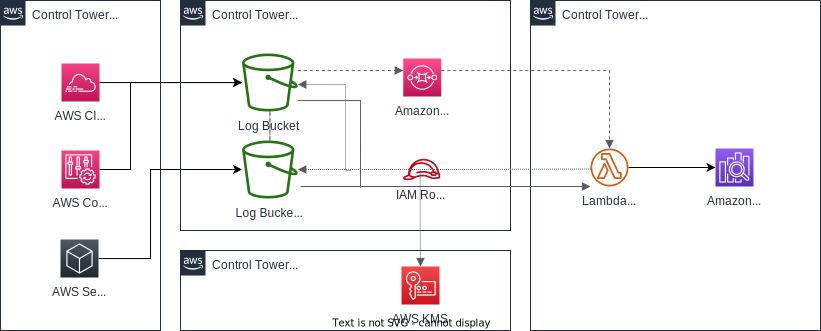
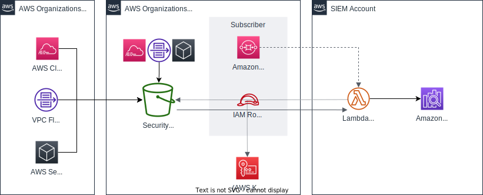

# SIEM on Amazon OpenSearch Service
<!-- markdownlint-disable-file MD033 -->

[English](README.md) | [Chinese (简体中文)](README_zh-cn.md) | [Chinese (繁體中文)](README_zh-tw.md)

SIEM on Amazon OpenSearch Service は、セキュリティインシデントを調査するためのソリューションです。Amazon OpenSearch Service を活用して、AWS のマルチアカウント環境下で、複数種類のログを収集し、ログの相関分析や可視化をすることができます。デプロイは、AWS CloudFormation または AWS Cloud Development Kit (AWS CDK) で行います。30分程度でデプロイは終わります。AWS サービスのログを Simple Storage Service (Amazon S3) のバケットに PUT すると、自動的に ETL 処理を行い、SIEM on OpenSearch Service に取り込まれます。ログを取り込んだ後は、ダッシュボードによる可視化や、複数ログの相関分析ができるようになります。

> Amazon OpenSearch Service のサービス名変更に伴い、SIEM on Amazon Elasticsearch Service から SIEM on Amazon OpenSearch Service に名前を変更しました。

Jump to | [AWS サービス(ログ送信元)の設定](docs/configure_aws_service_ja.md) | [SIEM の設定](docs/configure_siem_ja.md) | [高度なデプロイ](docs/deployment_ja.md) | [OpenSearch Serverless](docs/serverless_ja.md) | [ダッシュボード](docs/dashboard_ja.md) | [サポートログタイプ](docs/suppoted_log_type.md) | [AWS Control Tower との統合](docs/controltower_ja.md) |  [Amazon Security Lake との統合](docs/securitylake_ja.md) | [よくある質問](docs/faq_ja.md) | [変更履歴](CHANGELOG.md) |


## アーキテクチャ


[AWS Control Tower との統合](docs/controltower_ja.md)



[Amazon Security Lake との統合](docs/securitylake_ja.md)



## 対応ログ

SIEM on OpenSearch Service は以下のログを取り込むことができます。

|       |AWS Service|Log|
|-------|-----------|---|
|セキュリティ、ID、およびコンプライアンス|AWS CloudHSM|HSM audit logs|
|セキュリティ、ID、およびコンプライアンス|Amazon GuardDuty|GuardDuty findings|
|セキュリティ、ID、およびコンプライアンス|Amazon Inspector|Inspector findings|
|セキュリティ、ID、およびコンプライアンス|AWS Directory Service|Microsoft AD|
|セキュリティ、ID、およびコンプライアンス|AWS WAF|AWS WAF Web ACL traffic information<br>AWS WAF Classic Web ACL traffic information|
|セキュリティ、ID、およびコンプライアンス|AWS Security Hub|Security Hub findings<br>GuardDuty findings<br>Amazon Macie findings<br>Amazon Inspector findings<br>AWS IAM Access Analyzer findings|
|セキュリティ、ID、およびコンプライアンス|AWS Network Firewall|Flow logs<br>Alert logs|
|管理とガバナンス|AWS CloudTrail|CloudTrail Log Event<br>CloudTrail Insight Event|
|管理とガバナンス|AWS Config|Configuration 履歴<br>Configuration スナップショット<br>Config Rules|
|管理とガバナンス|AWS Trusted Advisor|Trusted Advisor チェック結果|
|ネットワーキングとコンテンツ配信|Amazon CloudFront|Standard access log<br>Real-time log|
|ネットワーキングとコンテンツ配信|Amazon Route 53 Resolver|VPC DNS query log|
|ネットワーキングとコンテンツ配信|Amazon Virtual Private Cloud (Amazon VPC)|VPC Flow Logs (Version5)<br>テキスト / Parquet 形式|
|ネットワーキングとコンテンツ配信|AWS Transit Gateway|VPC Flow Logs (Version6)<br>テキスト / Parquet 形式|
|ネットワーキングとコンテンツ配信|Elastic Load Balancing|Application Load Balancer access logs<br>Network Load Balancer access logs<br>Classic Load Balancer access logs|
|ネットワーキングとコンテンツ配信|AWS Client VPN|connection log|
|ストレージ|Amazon FSx for Windows File Server|audit log|
|ストレージ|Amazon Simple Storage Service (Amazon S3)|access log|
|データベース|Amazon Relational Database Service (Amazon RDS)|Amazon Aurora(MySQL)<br>Amazon Aurora(PostgreSQL)<br>Amazon RDS for MariaDB<br>Amazon RDS for MySQL<br>Amazon RDS for PostgreSQL|
|データベース|Amazon ElastiCache|ElastiCache for Redis SLOWLOG|
|分析|Amazon OpenSearch Service|Audit logs|
|分析|Amazon Managed Streaming for Apache Kafka (Amazon MSK)|Broker log|
|コンピューティング|Linux OS<br>via CloudWatch Logs|/var/log/messages<br>/var/log/secure|
|コンピューティング|Windows Server 2012/2016/2019<br>via CloudWatch Logs|System event log<br>Security event log|
|コンテナ|Amazon Elastic Container Service (Amazon ECS)<br>via FireLens|Framework only|
|エンドユーザーコンピューティング|Amazon WorkSpaces|Event log<br>Inventory|
|オープンソースソフトウェア|Apache Web Server|access log(CLF, combined, combinedio with XFF)<br>error log|
|オープンソースソフトウェア|NGINX Web Server|access log(combined with XFF)<br>error log|

Experimental Support はログフィールドの正規化等を大きく変更する可能性があります

対応ログは、[Elastic Common Schema](https://www.elastic.co/guide/en/ecs/current/index.html) に従って正規化しています。ログのオリジナルと正規化したフィールド名の対応表は [こちら](docs/suppoted_log_type.md) をご参照ください。

### Contribution

| Product/Service | Pull Request | Doc | Contributor |
|--------------------|----|------|-----------|
| TrendMicro Deep Security | [#27](//github.com/aws-samples/siem-on-amazon-opensearch-service/pull/27) | [README](docs/contributed/deepsecurity_ja.md) | [@EijiSugiura](//github.com/EijiSugiura) |
| Okta audit log | [#168](//github.com/aws-samples/siem-on-amazon-opensearch-service/pull/168) | [README](docs/contributed/okta_ja.md) | [@yopiyama](//github.com/yopiyama) |

## ダッシュボード

[こちら](docs/dashboard_ja.md) をご参照ください

## 開始方法

CloudFormation テンプレートを使って、SIEM on OpenSearch Service のドメインをパブリックアクセスに作成します。Amazon VPC 内へのデプロイやカスタマイズをする場合の手順は [こちら](docs/deployment_ja.md) をご参照ください。

IP アドレスに国情報や緯度・経度のロケーション情報を付与することができます。ロケーション情報は [MaxMind 社](https://www.maxmind.com)の GeoLite2 Free をダウンロードして活用します。ロケーション情報を付与したい方は MaxMind にて無料ライセンスを取得してください。

実験的に IP アドレス、ドメイン名を元に脅威情報を付与することができます。脅威情報のソースとして、TXT 形式と STIX 形式で作成されたユーザー独自の IoC (Indicators of compromise)、または [Tor Project](https://www.torproject.org)、[Abuse.ch Feodo Tracker](https://feodotracker.abuse.ch)、[AlienVault OTX](https://otx.alienvault.com/) を選択することができます。IoC 数が多いとは Lambda の処理時間が増えるので、IoC は厳選して下さい。AlienVault OTX の IoC を利用される方は、[AlienVault OTX](https://otx.alienvault.com/#signup) で API キーを取得して下さい。IoC の詳細は [IoC による脅威情報の付与](./docs/configure_siem_ja.md#IoC-による脅威情報の付与) をご参照下さい。

> **_注)_** CloudFormation テンプレートは OpenSearch Service を **t3.medium.search インスタンスでデプロイします。無料利用枠ではありません。また SIEM は、多くのログを集約して負荷が高くなるため、小さい t3 を避けて、メトリクスを確認しつつ最適なインスタンスを選択してください。** インスタンスの変更、ディスクの拡張、UltraWarm の使用等は、AWS マネジメントコンソールから直接行ってください。SIEM on OpenSearch Service の CloudFormation テンプレートは OpenSearch Service に対しては初期デプロイのみで、ノードの変更、削除等の管理はしません。

### 1. クイックスタート

SIEM on OpenSearch Service をデプロイするリージョンを選択してください。下記にテンプレートがない場合は [CloudFormation テンプレート 全リージョン](docs/cloudformation_list_ja.md) をご確認下さい。

| リージョン | CloudFormation | Template URL |
|----------|----------------|---------------|
| アジアパシフィック (東京)<br>ap-northeast-1 |[](https://console.aws.amazon.com/cloudformation/home?region=ap-northeast-1#/stacks/new?stackName=siem&templateURL=https://aes-siem-ap-northeast-1.s3.amazonaws.com/siem-on-amazon-opensearch-service.template) | `https://aes-siem-ap-northeast-1.s3.amazonaws.com/siem-on-amazon-opensearch-service.template` |
| アジアパシフィック (大阪)<br>ap-northeast-3 (※) |[](https://console.aws.amazon.com/cloudformation/home?region=ap-northeast-3#/stacks/new?stackName=siem&templateURL=https://aes-siem-ap-northeast-3.s3.amazonaws.com/siem-on-amazon-opensearch-service.template) | `https://aes-siem-ap-northeast-3.s3.amazonaws.com/siem-on-amazon-opensearch-service.template` |
| 米国東部 (バージニア北部)<br>us-east-1 |[](https://console.aws.amazon.com/cloudformation/home?region=us-east-1#/stacks/new?stackName=siem&templateURL=https://aes-siem-us-east-1.s3.amazonaws.com/siem-on-amazon-opensearch-service.template) | `https://aes-siem-us-east-1.s3.amazonaws.com/siem-on-amazon-opensearch-service.template` |
| 米国西部 (オレゴン)<br>us-west-2 |[](https://console.aws.amazon.com/cloudformation/home?region=us-west-2#/stacks/new?stackName=siem&templateURL=https://aes-siem-us-west-2.s3.amazonaws.com/siem-on-amazon-opensearch-service.template) | `https://aes-siem-us-west-2.s3.amazonaws.com/siem-on-amazon-opensearch-service.template` |
| 欧州 (フランクフルト)<br>eu-central-1 |[](https://console.aws.amazon.com/cloudformation/home?region=eu-central-1#/stacks/new?stackName=siem&templateURL=https://aes-siem-eu-central-1.s3.amazonaws.com/siem-on-amazon-opensearch-service.template) | `https://aes-siem-eu-central-1.s3.amazonaws.com/siem-on-amazon-opensearch-service.template` |
| 欧州 (ロンドン)<br>eu-west-2 |[](https://console.aws.amazon.com/cloudformation/home?region=eu-west-2#/stacks/new?stackName=siem&templateURL=https://aes-siem-eu-west-2.s3.amazonaws.com/siem-on-amazon-opensearch-service.template) | `https://aes-siem-eu-west-2.s3.amazonaws.com/siem-on-amazon-opensearch-service.template` |

> (※) 大阪リージョンのみ導入時は r5.large.search インスタンスでデプロイされます

またはこちらの[手順](./docs/configure_siem_ja.md#CloudFormation-テンプレートの作成)に従って CloudFormation のテンプレートを作成することもできます。

### 2. OpenSearch Dashboards の設定

約30分で CloudFormation によるデプロイが完了します。次に、OpenSearch Dashboards の設定をします。

1. AWS CloudFormation コンソールで、作成したスタックを選択。画面右上のタブメニューから「出力」を選択。OpenSearch Dashboards のユーザー名、パスワード、URL を確認できます。この認証情報を使って OpenSearch Dashboards にログインしてください
1. 最初のログイン時に [Select your tenant] と表示されるので、[**Global**] を選択してください。作成済みのダッシュボード等を利用できます。
1. [Select your tenant] で [Global] を選択せずに、[**Private**] を選んで、各ユーザー専用のダッシュボード等を用意して、カスタマイズをすることもできます。以下は、その方法で、Global を選んだ場合は設定不要です。
    1. OpenSearch Dashboards の Dashboard等 のファイルを[**ここ**](https://aes-siem.s3.amazonaws.com/assets/saved_objects.zip) からダウンロードします。ダウンロードしたファイルを解凍してください
    1. OpenSearch Dashboards のコンソールに移動してください。画面左側に並んでいるアイコンから「Stack Management」 を選択してください、「Saved Objects」、「Import」、「Import」の順に選択をして、先ほど解凍したZIPファイルの中ある「dashboard.ndjson」をインポートしてください
    1. インポートした設定ファイルを反映させるために一度ログアウトしてから、再ログインをしてください

### 3. ログの取り込み

S3 バケットの aes-siem-_[AWS アカウント ID]_-log にログを出力してください。ログは自動的に SIEM on OpenSearch Service に取り込まれて分析ができるようになります。

AWS の各サービスのログを S3 バケットへの出力する方法は、[こちら](docs/configure_aws_service_ja.md) をご参照ください。

## ワークショップ

[SIEM on Amazon OpenSearch Service のワークショップ](https://security-log-analysis-platform.workshop.aws/ja-JP/) を用意しています。SIEM の構築、AWS リソースのログの取り込み、OpenSearch Dashboards の使い方、セキュリティインシデントの調査、ダッシュボードの作成、アラートの作成、Apache HTTPD サーバーのログの取り込みを体験できます。

## SIEM のアップデート

SIEM on OpenSearch Service を新しいバージョンにアップデートする時は、OpenSearch / Elasticsearch のドメインをアップグレードしてから、初期インストールと同じ方法 (CloudFormation or AWS CDK) でアップデートしてください。SIEM の変更履歴は [こちら](CHANGELOG.md) から確認できます。

> **注) Global tenant の 設定やダッシュボード等は自動で上書きされるのでご注意ください。アップデート前に使用していた設定ファイルやダッシュボード等は S3 バケットの aes-siem-[AWS_Account]-snapshot/saved_objects/ にバックアップされるので、元の設定にする場合は手動でリストアしてください。**

> **注) S3 バケットポリシー、KMS の キーポリシー、IAM ポリシー等は、CDK/CloudFormation で自動生成されています。手動で変更は非推奨ですが、変更している場合は上書きされるので、それぞれをバックアップをしてからアップデート後に差分を更新して下さい。または、CDK/CloudFormation のアップデート時に、パラメーターの LogBucketPolicyUpdate を `keep` とすることで現在のバケットポリシーが維持されます**

### OpenSearch Service のドメインのアップグレード

OpenSearch Service を OpenSearch 1.0 - 2.17 または Elasticsearch 7.10 にアップグレードします。一部の Dashboard は OpenSearch Service 1.3 以上を前提にしています。推奨バージョンは OpenSearch 2.17 の「互換性モードを有効化」です。

1. [OpenSearch Service コンソール](https://console.aws.amazon.com/aos/home?) に移動
1. [**aes-siem**] ドメインを選択
1. [**アクション**] アイコンを選択して、プルダウンリストから [**ドメインのアップグレード**] を選択
1. アップグレード先のバージョンで [**OpenSearch 2.17**] (推奨)、[**OpenSearch 1.0 - 2.15**] または [**Elasticsearch 7.10**] を選択
1. OpenSearch の場合は、「互換性モードを有効化」にチェックを入れる (推奨)
1. [**送信**] を選択

CloudFormation で初期インストールした場合は次へ進み、AWS CDK で初期インストールしている場合は [高度なデプロイ](docs/deployment_ja.md) のアップデートを参照してください。

### es-loader レイヤー (設定ファイル) のバージョン確認

Lambda 関数の es-loaderは現在、Python 3.11 を指定しています。設定ファイルのレイヤーも同じバージョンで利用できる必要があります。該当の AWS Lambda レイヤーの [**互換性のあるバージョン**] を確認して、同じバージョンが含まれていなければ、含めるよう変更してください。

参考: [AWS Lambda レイヤーによる追加方法(推奨)](docs/configure_siem_ja.md#aws-lambda-レイヤーによる追加方法推奨)

### CloudFormation スタックの更新

CloudFormation のテンプレートを指定して更新します。テンプレートの URL は [CloudFormation テンプレート 全リージョン](docs/cloudformation_list_ja.md) をご確認下さい。

1. [CloudFormation コンソール](https://console.aws.amazon.com/cloudformation/home?) に移動
1. [**aes-siem**] のスタックを選択
1. 画面右上の [**更新する**] を選択
1. スタックの更新で下記を選択
    * テンプレートの準備: [**既存テンプレートを置き換える**]
    * テンプレートソース: [**Amazon S3 URL**]
    * Amazon S3 URL:
    * [**次へ**] を選択
1. 残りの全てデフォルト値で変更せず最後まで選択して完了

以上でアップデートは完了です。

## 設定変更

### デプロイ後の OpenSearch Service ドメインのリソース変更

OpenSearch Service のアクセスポリシーの変更、インスタンスのスペック変更、AZ の追加と変更、UltraWarm への変更等の OpenSearch Service ドメイン自体の変更は、AWS マネジメントコンソールの [OpenSearch Service コンソール](https://console.aws.amazon.com/aos/home?) から実行してください

### インデックス管理とカスタマイズ

SIEM on OpenSearch Service はログをインデックスに保存しており、デフォルトでは毎月1回ローテーションをしています。この期間を変更や、AWS 以外のログを取り込みたい方は、[こちら](docs/configure_siem_ja.md) をご参照ください。

## SIEM 管理以外の S3 バケットに保存されたログのニアリアルタイムの取り込み

SIEM と同一アカウント、同一リージョンに S3 バケットがある場合、OpenSearch にログを取り込むことができます。設定方法は [他の S3 バケットからニアリアルタイムの取り込み](docs/configure_siem_ja.md#他の-s3-バケットからニアリアルタイムの取り込み) を参照して下さい。

## バッチ処理による過去ログの取り込み

Python スクリプトの es-loader をローカル環境で実行することで、すでに S3 バケット に保存されている過去のログを SIEM on OpenSearch Service に取り込むことができます。詳細は、[S3 バケットに保存された過去データの取り込み](docs/configure_siem_ja.md#S3-バケットに保存された過去データの取り込み) を参照して下さい。

## 非常時の es-loader のスロットリングについて

es-loader の不必要な呼び出しを避けるため、以下の条件で es-loader をスロットリングします。

* OpenSearch Service クラスターの合計空き容量が 200MB 以下の状態が 30 分間継続し、`aes-siem-TotalFreeStorageSpaceRemainsLowAlarm` が発報した場合。
  * OpenSearch クラスターのストレージの空き容量が不足している状態です。復旧するには空き容量を増やす必要があります。詳しくは[使用可能なストレージ領域の不足](https://docs.aws.amazon.com/ja_jp/opensearch-service/latest/developerguide/handling-errors.html#handling-errors-watermark)を参照してください。

ログの取り込みを再開する場合は、AWS マネジメントコンソールや AWS CLI から Lambda 関数 `aes-siem-es-loader` の予約済同時実行数を0から10に戻してください。
また、[SQS の Dead Letter Queue からの取り込み](docs/configure_siem_ja.md#SQS-の-dead-letter-queue-からの取り込み) を参考にデッドレターキュー (aes-siem-dlq) からメッセージを取り込んでください。

## 作成される AWS リソース

CloudFormation テンプレートで作成される AWS リソースは以下の通りです。AWS Identity and Access Management (IAM) のリソースは AWS マネジメントコンソールから確認してください。

|AWS Resource|Resource Name|目的|
|------------|----|----|
|OpenSearch Service|aes-siem|SIEM 本体|
|S3 bucket|aes-siem-[AWS_Account]-log|ログを集約するため|
|S3 bucket|aes-siem-[AWS_Account]-snapshot|OpenSearch Service の手動スナップショット取得|
|S3 bucket|aes-siem-[AWS_Account]-geo|ダウンロードした GeoIP を保存|
|Step Functions|aes-siem-ioc-state-machine|IoC のダウンロードと Database の作成|
|Lambda function|aes-siem-aws-api-caller|CDK/CloudFormation から AWS API の呼び出ししに利用|
|Lambda function|aes-siem-ioc-plan|IoC をダウンロードするための map を作成|
|Lambda function|aes-siem-ioc-createdb|IoC をダウンロード|
|Lambda function|aes-siem-ioc-download|IoC の Database を作成|
|Lambda function|aes-siem-geoip-downloader|GeoIP のダウンロード|
|Lambda function|aes-siem-es-loader|ログを正規化し OpenSearch Service へロード|
|Lambda function|aes-siem-es-loader-stopper|非常時に es-loader をスロットリングするため|
|Lambda function|aes-siem-deploy-aes|OpenSearch Service のドメイン作成|
|Lambda function|aes-siem-configure-aes|OpenSearch Service の設定|
|Lambda function|aes-siem-index-metrics-exporter|OpenSearch Service の index に関する メトリクスを収集|
|Lambda function|aes-siem-BucketNotificationsHandler|ログ用 S3 バケットのイベント通知を設定|
|Lambda function|aes-siem-add-pandas-layer|es-loader にaws_sdk_pandas を Lambda レイヤーとして追加|
|AWS Key Management Service<br>(AWS KMS) KMSキー & Alias|aes-siem-key|ログの暗号化に使用|
|SSM Parameter Store|/siem/bucketpolicy/log/policy1-8|ログ用 S3 バケットの Bucket Policy の更新時に一時的に使用|
|Amazon SQS Queue|aes-siem-sqs-splitted-logs|処理するログ行数が多い時は分割。それを管理するキュー|
|Amazon SQS Queue|aes-siem-dlq|OpenSearch Service のログ取り込み失敗用 Dead Letter Queue|
|CloudWatch alarms|aes-siem-TotalFreeStorageSpaceRemainsLowAlarm|OpenSearch Service クラスターの合計空き容量が 200MB 以下の状態が 30 分間継続した場合に発報|
|CloudWatch dashboards|SIEM|SIEM on OpenSearch Service で利用するリソース情報のダッシュボード|
|EventBridge events|aes-siem-EventBridgeRuleStepFunctionsIoc|aes-siem-ioc-state-machine を定期的に実行|
|EventBridge events|aes-siem-EventBridgeRuleLambdaGeoipDownloader|aes-siem-geoip-downloader を12時間毎に実行|
|EventBridge events|aes-siem-EventBridgeRuleLambdaMetricsExporter|aes-siem-index-metrics-exporter を1 時間毎に実行|
|EventBridge events|aes-siem-EsLoaderStopperRule|アラートイベントを es-loader-stopper に渡す|
|Amazon SNS Topic|aes-siem-alert|OpenSearch Service の Alerting の Destinations で選択|
|Amazon SNS Subscription|inputed email|Alert の送信先メールアドレス|

## クリーンアップ

1. AWSマネジメントコンソールの CloudFormation からスタックの aes-siem を削除
1. 手動で次の AWS リソースを削除
    * OpenSearch Service ドメイン: aes-siem
    * Amazon S3 バケット: aes-siem-[AWS_Account]-log
    * Amazon S3 バケット: aes-siem-[AWS_Account]-snapshot
    * Amazon S3 バケット: aes-siem-[AWS_Account]-geo
    * AWS KMS カスタマーマネジメントキー: aes-siem-key
        * 削除は注意して行ってください。ログをこのカスタマーマネジメントキーで暗号化していると、キーの削除後はそのログは読み込むことができなくなります。
1. SIEM on OpenSearch Service を Amazon VPC 内にデプロイした場合は以下の AWS リソースも削除
    * Amazon VPC: aes-siem/VpcAesSiem (VPC を新規に作成した場合)
    * SecurityGroup: aes-siem-vpc-sg

> **_注)_** SIEM on OpenSearch Service をすぐに再デプロイする場合は、KMS キーのエイリアスが残っているため失敗します。次の AWS CLI コマンドで キーエイリアスを削除してください

```shell
export AWS_DEFAULT_REGION=<AWS_REGION>
aws kms delete-alias --alias-name  "alias/aes-siem-key"
```

## Security

See [CONTRIBUTING](CONTRIBUTING.md#security-issue-notifications) for more information.

## License

This library is licensed under the MIT-0 License. See the [LICENSE](LICENSE) file.

This product uses GeoLite2 data created by MaxMind and licensed under [CC BY-SA 4.0](https://creativecommons.org/licenses/by-sa/4.0/), available from [https://www.maxmind.com](https://www.maxmind.com).

This product uses Tor exit list created by The Tor Project, Inc and licensed under [CC BY 3.0 US](https://creativecommons.org/licenses/by/3.0/us/), available from [https://www.torproject.org](https://www.torproject.org)
