# Configuring AWS Services

[View this page in Japanese (日本語)](configure_aws_service_ja.md) | [Back to README](../README.md)

On this page, we’ll walk you through how to load logs from each AWS service into SIEM on Amazon OpenSearch Service. Follow the steps below to configure each AWS service.

## Table of contents

1. [Common Configurations](#1-Common-Configurations)
1. [Security, Identity, & Compliance](#2-Security-Identity--Compliance)
    * [Amazon GuardDuty](#Amazon-GuardDuty)
    * [AWS Directory Service](#AWS-Directory-Service)
    * [AWS WAF](#AWS-WAF)
    * [AWS Security Hub](#AWS-Security-Hub)
    * [AWS Network Firewall](#AWS-Network-Firewall)
1. [Management & Governance](#3-Management--Governance)
    * [AWS CloudTrail](#AWS-CloudTrail)
1. [Networking & Content Delivery](#4-Networking--Content-Delivery)
    * [Amazon CloudFront](#Amazon-CloudFront)
    * [Route 53 Resolver VPC DNS Query Logging](#Route-53-Resolver-VPC-DNS-Query-Logging)
    * [Amazon Virtual Private Cloud (Amazon VPC) Flow Logs](#Amazon-VPC-Flow-Logs)
    * [Elastic Load Balancing (ELB)](#Elastic-Load-Balancing-ELB)
1. [Storage](#5-Storage)
    * [Amazon FSx for Windows File Server audit log](#Amazon-FSx-for-Windows-File-Server-audit-log)
    * [Amazon Simple Storage Service (Amazon S3) access logs](#Amazon-S3-access-logs)
1. [Database](#6-Database)
    * [RDS (Aurora MySQL / MySQL / MariaDB)](#RDS-Aurora-MySQL--MySQL--MariaDB-Experimental-Support)
    * [RDS (Aurora PostgreSQL / PostgreSQL)](#RDS-Aurora-PostgreSQL--PostgreSQL-Experimental-Support)
1. [Analytics](#7-Analytics)
    * [Amazon Managed Streaming for Apache Kafka (Amazon MSK)](#Amazon-MSK)
1. [Compute](#8-Compute)
    * [EC2 Instance (Amazon Linux 2)](#EC2-Instance-Amazon-Linux-2)
    * [EC2 Instance (Microsoft Windows Server 2012/2016/2019)](#EC2-Instance-Microsoft-Windows-Server-201220162019)
1. [Containers](#9-Containers)
    * [FireLens for Amazon ECS](#FireLens-for-Amazon-ECS)
1. [End User Computing](#10End-User-Computing)
    * [Amazon WorkSpaces](#Amazon-WorkSpaces)
1. [Multiple regions / multiple accounts](#11-Multiple-regions--multiple-accounts)
1. [Loading logs from an existing S3 bucket](#12-Loading-logs-from-an-existing-S3-bucket)

## 1. Common Configurations

SIEM on OpenSearch Service determines the log type based on the name and path of the file that is put into the Amazon Simple Storage Service (Amazon S3) bucket. The initial value used for this is either the default output path or file name of each service. Additional identifiable information is used for services where the log type cannot be determined using the default values only. If you want to output logs to S3 using a file path different from the initial value, create user.ini and add your own file name or S3 object key to the “s3_key” field. See [Changing Configurations of SIEM on OpenSearch Service](configure_siem.md) on how to edit user.ini.

If you have the privilege of setting an arbitrary output path to the S3 bucket, include your AWS account ID and region in the output path (as the prefix). This information will be attached to the loaded logs. However, if the information is already contained in the logs, the information in the logs will be prioritized.

if you want to store files in the S3 bucket enabling AWS Key Management Service (AWS KMS) encryption, use the AWS KMS customer-managed key that is automatically created when deploying SIEM on OpenSearch Service. The default alias name is aes-siem-key. You can also use an existing AWS KMS customer-managed key. Click [here](deployment.md) to see how to do this.

The AWS account used here for instruction purpose is **123456789012** . Replace this with your AWS account when following the steps.

## 2. Security, Identity, & Compliance

### Amazon GuardDuty

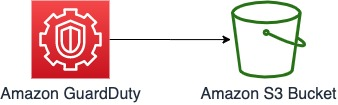

The initial value of s3_key: `GuardDuty` (part of the default output path)

1. Log in to the AWS Management Console
1. Navigate to the [GuardDuty](https://console.aws.amazon.com/guardduty/home?) console
1. Choose [**Settings**] from the left pane
1. Scroll to [Findings export options] panel
1. Frequency for updated findings: Choose [**Update CWE and S3 every 15 minutes**] and then choose [**Save**] (recommended)
1. Choose [**Configure now**] for S3 bucket and enter the following parameters:
   * Check [**Existing bucket  In your account**]
   * Choose a bucket: Choose [**aes-siem-123456789012-log**]
      * Replace 123456789012 with your AWS account ID
   * Log file prefix: Leave blank
   * KMS encryption: Check [**Choose key from your account**]
   * Key alias: Choose [**aes-siem-key**]
   * Choose [**Save**]

Configuration is now complete. Choose [**Generate sample findings**] on the same settings screen to verify that loading into SIEM on OpenSearch Service has been successfully set up.

### AWS Directory Service

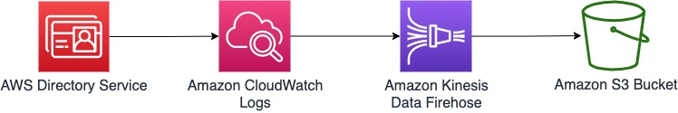

The initial value of s3_key : `/DirectoryService/MicrosoftAD/` (specified in the Firehose output path)

1. Navigate to the [Directory Service Console](https://console.aws.amazon.com/directoryservicev2/home?) and forward log to CloudWatch Logs.
1. Configure with CloudFormation
    * [siem-log-exporter-basic.template](https://raw.githubusercontent.com/aws-samples/siem-on-amazon-elasticsearch/main/deployment/log-exporter/siem-log-exporter-basic.template)
    * [siem-log-exporter-ad.template](https://raw.githubusercontent.com/aws-samples/siem-on-amazon-elasticsearch/main/deployment/log-exporter/siem-log-exporter-ad.template)

### AWS WAF

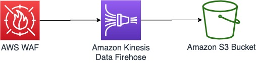

AWS WAF has two types: AWS WAF and AWS WAF Classic. You should, however, output both to the S3 bucket in the same way.

The initial value of s3_key: `aws-waf-logs-`

AWS WAF ACL traffic logs are exported from Kinesis Data Firehose to the S3 bucket. Kinesis Data Firehose names must start with [**aws-waf-logs-**], and because this prefix is included in the file names when they are output to the S3 bucket, we are using it to determine the log type.

#### I. Common Configurations for AWS WAF

First, deploy Kinesis Data Firehose

1. Navigate to [](https://console.aws.amazon.com/kinesis/home?)the Amazon Kinesis console and select the **region where AWS WAF was deployed**
1. Choose [**Delivery streams**] from the left pane => [**Create delivery stream**]
1. On the [New delivery stream] screen, enter the following parameters:
   * Delivery stream name: Enter [**aws-waf-logs-XXXX(any name)**]
   * Source: Check [**Direct PUT or other sources**]
   * Choose [**Next**]
1. On the [Process records] screen, choose the following parameters:
   * Data transformation: [**Disabled**]
   * Record format conversion: [**Disabled**]
   * Choose [**Next**]
1. On the [Choose a destination] screen, choose/enter the following parameters:
   * Destination: [**Amazon S3**]
   * S3 bucket: [**aes-siem-123456789012-log**]
      * Replace 123456789012 with your AWS account ID
   * S3 prefix: Enter [**AWSLogs/123456789012/WAF/region/**]
   * S3 error prefix: Enter [**AWSLogs/123456789012/WAF/region/error/**]
      * Replace 123456789012 with your AWS account and ap-northeast-1 with your region. If the resource to which you attach WAF is CloudFront, set the region to **global**
1. On the [Configure settings] screen, enter the following parameters:
   * Buffer size: Enter [**any number**]
   * Buffer interval: Enter [**any number**]
   * S3 compression: [**GZIP**]
   * Leave the following parameters as default
   * Choose [**Next**]
1. Choose [**Create delivery stream**]

#### II. Logging Configuration for AWS WAF

1. Navigate to the [WAFv2 console](https://console.aws.amazon.com/wafv2/home?)
1. Choose [**Web ACLs**] from the left pane
1. From the drop-down menu at the center of the screen, choose the [**region**] where you deployed WAF => Choose the name of the target WAF to collect logs from
1. Choose [**Logging and metrics**] tab => [**Enable logging**]
1. From the [Amazon Kinesis Data Firehose Delivery Stream] drop-down menu, choose the [**Kinesis Firehose you created**]
1. Choose [**Enable logging**] to complete the configuration

#### III. Logging Configuration for WAF Classic

1. Navigate to the [WAF Classic console](https://console.aws.amazon.com/waf/home?)
1. Choose [**Web ACLs**] from the left pane
1. From the drop-down menu at the center of the screen, choose the [**region**] where you deployed WAF => Choose the name of the target WAF to collect logs from
1. Choose the [**Logging**] tab at the top right of the screen => Choose [**Enable logging**]
1. From the [Amazon Kinesis Data Firehose] drop-down menu, choose the [**Kinesis Firehose you created**]
1. Choose [**Create**] to complete the configuration

### AWS Security Hub

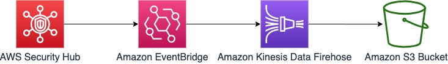

The initial value of s3_key: `SecurityHub` (specified in the Firehose output path)

* Log output is sent via Kinesis Data Firehose, and since there is no standard save path, use the above s3_key as the prefix of the destination S3 bucket for Kinesis Data Firehose.
* Create Firehose and EventEngine rules for each region when aggregating Security Hub findings from multiple regions

Configuring Kinesis Data Firehose

1. Navigate to the [Amazon Kinesis console](https://console.aws.amazon.com/kinesis/home?)
1. Choose [**Delivery streams**] from the left pane
1. Choose [**Create delivery stream**] at the top left of the screen
1. On the [New delivery stream] screen, enter the following parameters:
   * Delivery stream name: Enter [**aes-siem-firehose-securityhub**]
   * Source: Check [**Direct PUT or other sources**]
   * [Enable server-side encryption for source records in delivery stream] is optional
   * Choose [**Next**]
1. On the [Process records] screen, choose the following parameters:
   * Data transformation: [**Disabled**]
   * Record format conversion: [**Disabled**]
   * Choose [**Next**]
1. On the [Choose a destination] screen, choose/enter the following parameters:
   * Destination: [**Amazon S3**]
   * S3 bucket: [**aes-siem-123456789012-log**]
   * S3 prefix: Enter [**AWSLogs/123456789012/SecurityHub/[region]/**]
   * S3 error prefix: Enter [**AWSLogs/123456789012/SecurityHub/[region]/error/**]
      * Replace 123456789012 with your AWS account and [region] with your region.
1. On the [Configure settings] screen, enter the following parameters:
   * Buffer size: Enter [**any number**]
   * Buffer interval: Enter [**any number**]
   * S3 compression: [**GZIP**]
   * Leave the following parameters as default
   * Choose [**Next**]
1. Choose [**Create delivery stream**] to complete deployment of Kinesis Data Firehose

Configuring EventBridge

1. Navigate to the [EventBridge console](https://console.aws.amazon.com/events/home?)
1. Choose [**Rules**] from the left pane => [**Create rule**]
1. Enter the following parameters on the [Create rule] screen:
   * Name: aes-siem-securityhub-to-firehose
   * Define pattern: Choose Event pattern
   * Event matching pattern: Pre-defined pattern by service
   * Service provider: AWS
   * Service Name: Security Hub
   * Event Type: Security Hub Findings - Imported
   * No change required for the “Select event bus” pane
   * Target: Firehose delivery stream
   * Stream: aes-siem-firehose-securityhub
   * Choose any value for the rest
   * Choose [**Create**] to complete the configuration

### AWS Network Firewall

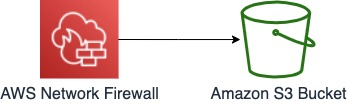

The initial value of s3_key: `_network-firewall_` (part of the default output path)

Ref: [AWS Network Firewall - Developer Guide - Logging and monitoring in AWS Network Firewall(S3)](https://docs.aws.amazon.com/network-firewall/latest/developerguide/logging-s3.html)

## 3. Management & Governance

### AWS CloudTrail

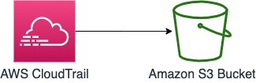

The initial value of s3_key: `CloudTrail/` or `CloudTrail-Insight/` (part of the default output path)

Follow the steps below to output CloudTrail logs to the S3 bucket:

1. Log in to the AWS Management Console
1. Navigate to [the CloudTrail console](https://console.aws.amazon.com/cloudtrail/home?)
1. Select [**Trails**] from the left pane => Choose [**Create trail**] at the top right.
1. Enter the following parameters on the [Choose trail attributes] screen.
   * Trail name: [**aes-siem-trail**]
   * Enable for all accounts in my organization: any (Skip this step if the field is grayed out and you are unable to check the box)
   * Storage location: Check [**Use existing S3 bucket**]
   * Select [**aes-siem-123456789012-log**]
      * Replace 123456789012 with your AWS account ID
   * Log file SSE-KMS encryption: Recommended to check [**Enabled**]
   * AWS KMS customer managed CMK: Check [**Existing**]
   * AWS KMS alias: Choose [**aes-siem-key**]
   * Log file validation: Recommended to check [**Enable**]
   * SNS notification delivery: Don’t check Enabled
   * CloudWatch Logs: Don’t check Enabled
   * Tags: any
1. Choose [**Next**]
1. On the [Choose log events] screen, enter the following parameters:
   * Event type
      * Management events: [**checked**]
      * Data events: any
      * Insights events: any
   * Management events
      * API activity: Check both [Read] and [Write]
      * Exclude AWS KMS events: any
1. Choose [**Next**]
1. Choose [**Create trail**]

## 4. Networking & Content Delivery

### Amazon CloudFront

For CloudFront, you can record requests sent for distribution in two ways. Standard logs (access logs) and real-time logs. Click [here](https://docs.aws.amazon.com/ja_jp/AmazonCloudFront/latest/DeveloperGuide/logging.html) to see the difference between the two.

#### I. CloudFront Standard Log (Access Log)

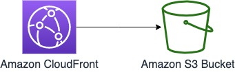

The initial value of s3_key: `(^|\/)[0-9A-Z]{13,14}\.20\d{2}-\d{2}-\d{2}-\d{2}.[0-9a-z]{8}\.gz$$`

The log type is determined by the default output file name using regular expressions. The logs do not contain AWS account IDs, so you should include them in the S3 prefix.

1. Log in to the AWS Management Console
1. Navigate to [the Amazon CloudFront console](https://console.aws.amazon.com/cloudfront/home?)
1. Choose [**Logs**] from the left pane => [**Distribution logs**] tab
1. Choose the [**Distribution ID**] for which you want to load logs
1. Choose [**Edit**] which is next to [Standard logs] title
1. Enter the following parameters in the [Edit standard logs] window that pops up
   * Set Standard logs to [**Enabled**]
   * S3 bucket: [**aes-siem-123456789012-log**]
      * Replace 123456789012 with your AWS account ID
   * S3 bucket prefix: [**AWSLogs/123456789012/CloudFront/global/distribution ID/standard/**]
      * Replace “123456789012” with your AWS account ID, and “ditribution ID” with your CloudFront distribution ID
   * Cookie logging: [**Yes**]
   * Choose [**Update**] to complete the configuration

#### II. CloudFront real-time logs

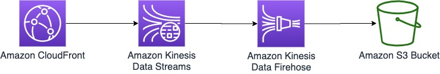

CloudFront real-time logs are delivered to the data stream that you choose in Amazon Kinesis Data Streams. Then the log data is sent to Amazon S3 via Amazon Kinesis Data Firehose.

The initial value of s3_key: `CloudFront/.*/realtime/`

Because real-time logs do not have a standard storage path, specify the S3 path above with a prefix. You can use any characters for .* (period and asterisk), so include the region etc. CloudFront logs do not contain AWS account IDs and distribution IDs, so ensure to include them in the S3 prefix.

Configure them in the following order:

1. Kinesis Data Stream
1. Kinesis Data Firehose
1. CloudFront

Configuring Kinesis Data Stream and Kinesis Data Firehose:

1. Log in to the AWS Management Console
1. Navigate to [the Amazon Kinesis console](https://console.aws.amazon.com/kinesis/home?region=us-east-1) in **N.Virginia region**
1. Choose [**Data streams**] from the left pane => [**Create a data stream**]
1. Enter the following parameters on the [Create a data stream] screen
   * Data stream name: Enter [**any name**]
   * Number of open shards: Enter [**any number of shards**]
   * Choose [**Create data stream**]
1. Now you’re ready to configure Kinesis Data Firehose. Wait until the status of the created data stream becomes [active] and then choose [**Process with delivery stream**] from the [Consumers] pane at the bottom of the screen.
1. On the [New delivery stream] screen, enter the following parameters:
   * Delivery stream name: Enter [**any name**]
   * Source: Check [**Kinesis Data Stream**]
   * Kinesis data stream: Choose the [**Kinesis data stream created in the previous step**]
   * Choose [**Next**]
1. On the [Process records] screen, choose the following parameters:
   * Data transformation: [**Disabled**]
   * Record format conversion: [**Disabled**]
   * Choose [**Next**]
1. On the [Choose a destination] screen, choose/enter the following parameters:
   * Destination: [**Amazon S3**]
   * S3 bucket: [**aes-siem-123456789012-log**]
      * Replace 123456789012 with your AWS account ID
   * S3 prefix: [**AWSLogs/123456789012/CloudFront/global/distribution ID/realtime/**]
      * Replace 123456789012 with your AWS account ID
   * S3 error prefix: [**AWSLogs/123456789012/CloudFront/global/distribution ID/realtime/error/**]
1. On the [Configure settings] screen, enter the following parameters:
   * Buffer size: Enter [**any number**]
   * Buffer interval: Enter [**any number**]
   * S3 compression: [**GZIP**]
   * Leave the following parameters as default
   * Choose [**Next**]
1. Choose [**Create delivery stream**]

Configuring Amazon CloudFront:

1. Navigate to [the Amazon CloudFront console](https://console.aws.amazon.com/cloudfront/home?)
1. Choose [**Logs**] from the left pane => Choose [**Real-time log configurations**] tab
1. Choose [**Create configuration**] on the right side of the screen
1. Enter the following parameters on the [Create real-time log configuration] screen
   * Name: Enter [**any name**]
   * Sampling rate: [**100**]
      * Importing all logs into SIEM on OpenSearch Service
   * Fields: [**Check all fields**]
      * All are checked by default
   * Endpoint: Choose the [**Kinesis data stream created two steps previously**]
   * IAM role: Choose [**Create new service role CloudFrontRealtimeLogConfiguRole-XXXXXXXXXXXX**]
   * Distribution: Choose [**the target distribution**]
   * Cache behavior(s): Choose [**Default(*)**]
1. Choose [**Create configuration**] to complete the configuration

### Route 53 Resolver VPC DNS Query Logging

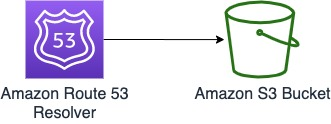

The initial value of s3_key: `vpcdnsquerylogs` (part of the default output path)

1. Navigtate to the [Route 53 Resolver console](https://console.aws.amazon.com/route53resolver/home?)
1. Choose [**Query logging**] from the left pane
1. Enter the following parameters on the [Configure query logging] screen
   * Name: Enter [**any name**]
   * Destination for query logs: Choose [**S3 bucket**]
   * Amazon S3 bucket: Choose [**aes-siem-123456789012-log**]
      * Replace 123456789012 with your AWS account ID
   * VPCs to log queries for: [**Add any VPC**]
1. Choose [**Configure query logging**] to complete the configuration

### Amazon VPC Flow Logs

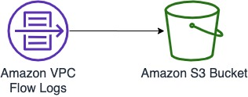

The initial value of s3_key: `vpcflowlogs` (part of the default output path)

Follow the steps below to output VPC flow logs to the S3 bucket:

1. Log in to the AWS Management Console
1. Navigate to the [Amazon VPC console](https://console.aws.amazon.com/vpc/home?)
1. Choose [**VPC**] or [**Subnet**] from the left pane => Check the box of the resource to load
1. Choose the [**Flow logs**] tab at the bottom of the screen => Choose [ **Create flow log**]
1. Enter the following parameters on the Create flow log screen
   * Name: any name
   * Filter: any, but [**All**] is recommended
   * Maximum aggregation interval: any, but setting this to 1 minute will increase the log volume
   * Destination: Check [**Send to an S3 bucket**]
   * S3 bucket ARN: [**arn:aws:s3:::aes-siem-123456789012-log**]
      * Replace 123456789012 with your AWS account ID
   * Log record format: Check [**AWS default format**] or check "Custom format" and select "Log format".
   * Tags: any
1. Choose [**Create flow log**]

### Elastic Load Balancing (ELB)

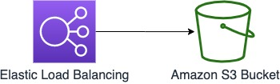

Follow the steps below to output each of the following three load balancer logs to the S3 bucket:

* Application Load Balancer(ALB)
* Network Load Balancer(NLB)
* Classic Load Balancer(CLB)

The initial value of s3_key is determined by the default output path and file name using regular expressions

* ALB: `elasticloadbalancing_.*T\d{4}Z_\d{1,3}\.\d{1,3}\.\d{1,3}\.\d{1,3}_\w*\.log\.gz$$`
* NLB: `elasticloadbalancing_.*T\d{4}Z_[0-9a-z]{8}\.log\.gz$$`
* CLB: `elasticloadbalancing_.*T\d{4}Z_\d{1,3}\.\d{1,3}\.\d{1,3}\.\d{1,3}_\w*\.log$$`

1. Log in to the AWS Management Console
1. Navigate to the [Amazon EC2 console](https://console.aws.amazon.com/ec2/home?)
1. Choose [**Load balancers**] from the left pane => [**Check the box**] of the target load balancer to collect logs from
1. Choose [Description ] tab => Enter the following parameters for ALB/NLB/CLB:
   * For ALB/NLB: Choose [**Edit attributes**]
      * Access logs: Check [**Enable**]
      * S3 location: Enter [**aes-siem-123456789012-log**]
         * Replace 123456789012 with your AWS account ID
      * Create this location for me: unchecked
      * Choose [**Save**]
   * For CLB: Choose [**Configure Access Logs**]
      * Enable access logs: [**checked**]
      * Interval: Choose [**5 minutes or 60 minutes**]
      * S3 location: Enter [**aes-siem-123456789012-log**]
         * Replace 123456789012 with your AWS account ID
      * Create this location for me: unchecked
      * Choose [**Save**] to complete the configuration

## 5. Storage

### Amazon FSx for Windows File Server audit log

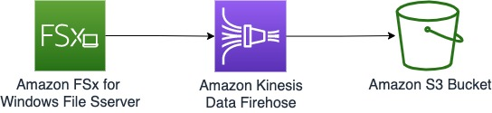

The initial value of s3_key: `aws-fsx-`

Amazon FSx for Windows File Server audit logs are exported from Kinesis Data Firehose to the S3 bucket. Kinesis Data Firehose names must start with [**aws-fsx-**], and because this prefix is included in the file names when they are output to the S3 bucket, we are using it to determine the log type.

1. Configure with CloudFormation
    * [siem-log-exporter-basic.template](https://raw.githubusercontent.com/aws-samples/siem-on-amazon-elasticsearch/main/deployment/log-exporter/siem-log-exporter-basic.template)
    * [siem-log-exporter-fsx.template](https://raw.githubusercontent.com/aws-samples/siem-on-amazon-elasticsearch/main/deployment/log-exporter/siem-log-exporter-fsx.template)
1. Navigate to the [FSx Console](https://console.aws.amazon.com/fsx/home?) and forward logs to Firehose.

### Amazon S3 access logs

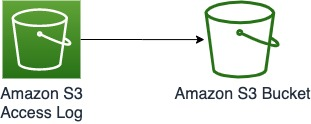

Follow the steps below to output S3 access logs to the S3 bucket. If you are already capturing S3 logs using CloudTrail data events, click [here](https://docs.aws.amazon.com/ja_jp/AmazonS3/latest/dev/logging-with-S3.html) to see the difference from S3 access logging.

The initial value of s3_key: `s3accesslog` (there is no standard save path, so specify it using a prefix)

1. Log in to the AWS Management Console
1. Navigate to the [Amazon S3 console](https://console.aws.amazon.com/s3/home?)
1. From the bucket list, choose the S3 bucket you want to collect logs from.
1. Choose [**Properties**] tab => [**Server access logging**]
   1. Check Enable logging
   1. Choose target bucket: aes-siem-123456789012-log
      * Replace 123456789012 with your AWS account ID
   1. Target prefix: [**AWSLogs/AWS account ID/s3accesslog/region/bucket name/** ]
      * It’s important to have [s3accesslog] in the path
   1. Choose [**Save**]

## 6. Database

### RDS (Aurora MySQL / MySQL / MariaDB) (Experimental Support)


* Erorr log
* Slow query log
* General log
* Audit log

The initial value of s3_key (specified in the Firehose output path)

* Erorr log: `(MySQL|mysql|MariaDB|mariadb).*(error)`
* Slow query log: `(MySQL|mysql|MariaDB|mariadb).*(slowquery)`
* General log: `(MySQL|mysql|MariaDB|mariadb).*(general)`
* Audit log: `(MySQL|mysql|MariaDB|mariadb).*(audit)`

#### Reference (Aurora MySQL / MySQL / MariaDB)

* [Aurora User Guide / MySQL database log files](https://docs.aws.amazon.com/AmazonRDS/latest/AuroraUserGuide/USER_LogAccess.Concepts.MySQL.html)
* [RDS User Guide / MySQL database log files](https://docs.aws.amazon.com/AmazonRDS/latest/UserGuide/USER_LogAccess.Concepts.MySQL.html)
* [RDS User Guide / MariaDB database log files](https://docs.aws.amazon.com/AmazonRDS/latest/UserGuide/USER_LogAccess.Concepts.MariaDB.html)
* [Using advanced auditing with an Amazon Aurora MySQL DB cluster](https://docs.aws.amazon.com/AmazonRDS/latest/AuroraUserGuide/AuroraMySQL.Auditing.html#AuroraMySQL.Auditing.Logs)
* [How do I publish logs for Amazon RDS or Aurora for MySQL instances to CloudWatch?](https://aws.amazon.com/premiumsupport/knowledge-center/rds-aurora-mysql-logs-cloudwatch/)
* [How can I enable audit logging for an Amazon RDS MySQL or MariaDB instance and publish the logs to CloudWatch?](https://aws.amazon.com/premiumsupport/knowledge-center/advanced-audit-rds-mysql-cloudwatch/)

### RDS (Aurora PostgreSQL / PostgreSQL) (Experimental Support)

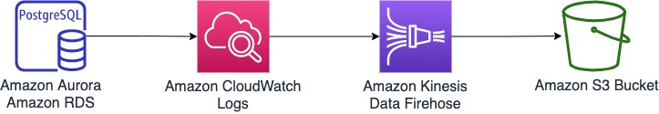

The initial value of s3_key : `Postgre` or `postgres` (specified in the Firehose output path)

#### Reference (Aurora PostgreSQL / PostgreSQL)

* [Aurora User Guide / PostgreSQL database log files](https://docs.aws.amazon.com/AmazonRDS/latest/AuroraUserGuide/USER_LogAccess.Concepts.PostgreSQL.html)
* [RDS User Guide / PostgreSQL database log files](https://docs.aws.amazon.com/AmazonRDS/latest/UserGuide/USER_LogAccess.Concepts.PostgreSQL.html)
* [How do I enable query logging using Amazon RDS for PostgreSQL?](https://aws.amazon.com/premiumsupport/knowledge-center/rds-postgresql-query-logging/)
* [Configuring and authoring Kibana dashboards](https://aws.amazon.com/blogs/database/configuring-and-authoring-kibana-dashboards/)
* [How can I track failed attempts to log in to my Amazon RDS DB instance that's running PostgreSQL?](https://aws.amazon.com/premiumsupport/knowledge-center/track-failed-login-rds-postgresql/)

## 7. Analytics

### Amazon MSK

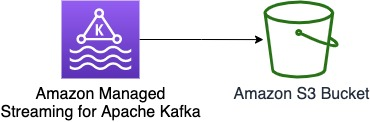

The initial value of s3_key: `KafkaBrokerLogs` (part of the default output path)

## 8. Compute

### EC2 Instance (Amazon Linux 2)

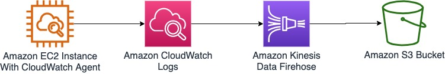

OS system logs -
The initial value of s3_key: `/[Ll]inux/` (specified in the Firehose output path)

Secure logs -
The initial value of s3_key: `[Ll]inux.?[Ss]ecure` (specified in the Firehose output path)

Log output is sent via Kinesis Data Firehose, and since there is no standard save path, use the above s3_key as the prefix of the destination S3 bucket for Kinesis Data Firehose. Region information is not contained in the logs, so you can include it in your S3 key to capture it. There are two ways to load secure logs : loading logs as OS system logs and then classifying them as secure logs; or loading logs as secure logs from the beginning. The former method determines secure logs by the process name, so choose the latter to ensure all secure logs are fully loaded. The latter, on the other hand, requires you to deploy Firehose for each log destination.

Here’s an outline of the steps:

1. Install CloudWatch Agent in the EC2 instance deployed as Amazon Linux 2
1. Forward logs to CloudWatch Logs
1. Output logs to Firehose using a CloudWatch Logs subscription
1. Choose the S3 bucket as the destination for Firehose output
1. Destination S3 bucket
   * Prefix to output logs as OS logs: [**AWSLogs/123456789012/EC2/Linux/[region]/**]
   * Prefix to output logs as secure Log: [**AWSLogs/123456789012/EC2/Linux/Secure/[ region]/**]
      * Replace 123456789012 with your AWS account ID

### EC2 Instance (Microsoft Windows Server 2012/2016/2019)


The initial value of s3_key : `/[Ww]indows.*[Ee]vent` (specified in the Firehose output path)

Log output is sent via Kinesis Data Firehose, and since there is no standard save path, use the above s3_key as the prefix of the destination S3 bucket for Kinesis Data Firehose. Region information is not contained in the logs, so you can include it in your S3 key to capture it.

Here’s an outline of the steps:

1. Install CloudWatch Agent in the EC2 instance deployed as Windows Server
1. Forward logs to CloudWatch Logs
1. Configure with CloudFormation
    * [siem-log-exporter-basic.template](https://raw.githubusercontent.com/aws-samples/siem-on-amazon-elasticsearch/main/deployment/log-exporter/siem-log-exporter-basic.template)
    * [siem-log-exporter-cwl-nocompress.template](https://raw.githubusercontent.com/aws-samples/siem-on-amazon-elasticsearch/main/deployment/log-exporter/siem-log-exporter-cwl-nocompress.template)
    * Prefix to output logs : [**AWSLogs/123456789012/EC2/Windows/Event/[region]/**]
        * Replace 123456789012 with your AWS account ID

## 9. Containers

### FireLens for Amazon ECS

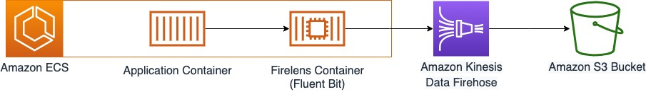

The initial value of s3_key: N/A. Create and configure Firehose for each container application

* ECS logs are sent to Firehose via Firelens (Fluent Bit) and output to S3
* The log type of each container application is determined by the S3 file path. So you need to provision Firehose for each log type
* Container information is captured from ECS metadata. [Enable it in task definitions](https://docs.aws.amazon.com/ja_jp/AmazonECS/latest/developerguide/using_firelens.html#firelens-taskdef-metadata)
* By default, STDERR is not loaded. If you want to load it, set ignore_container_stderr = False in user.ini. @timestamp is the time at which the SIEM log was received.

Configuring Kinesis Data Firehose

1. Follow the steps in [Kinesis Data Firehose Settings] in Security Hub.
1. Include the key that determines the application in the output path to S3 (apache, for example)
1. Because the AWS acount and region are captured from the logs stored in S3, it is optional to include these two parameters in the S3 output path

Configuring AWS Firelens

1. For information about the task definition file for sending logs via Firelens and IAM permission settings, see [official documentation](https://docs.aws.amazon.com/ja_jp/AmazonECS/latest/userguide/using_firelens.html) and aws-samples’ [Send to Kinesis Data Firehose in amazon-ecs-firelens-examples](https://github.com/aws-samples/amazon-ecs-firelens-examples/tree/mainline/examples/fluent-bit/kinesis-firehose)

Configuring SIEM

1. Include the following for each log type in user.ini

```ini
# Specifying the logs are via firelens
via_firelens = True
# Specifying whether stderr is loaded or not. Logs will not be loaded if this is True
ignore_container_stderr = True
```

## 10. End User Computing

### Amazon WorkSpaces

#### Event

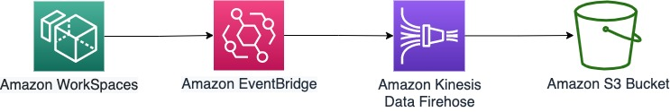

The initial value of s3_key : `(WorkSpaces|workspaces).*(Event|event)` (specified in the Firehose output path)

#### Inventory

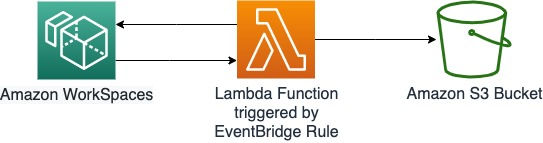

The initial value of s3_key : `(WorkSpaces|workspaces).*(Inventory|inventory)`

1. Configure with CloudFormation
     * [siem-log-exporter-basic.template](https://raw.githubusercontent.com/aws-samples/siem-on-amazon-elasticsearch/main/deployment/log-exporter/siem-log-exporter-basic.template)
     * [siem-log-exporter-workspaces.template](https://raw.githubusercontent.com/aws-samples/siem-on-amazon-elasticsearch/main/deployment/log-exporter/siem-log-exporter-workspaces.template)

## 11. Multiple regions / multiple accounts

You can load logs from other accounts or regions into SIEM on OpenSearch Service by using S3 replication or cross-account output to the S3 bucket that stores logs.
The output paths should be follow the S3 keys configured above.

## 12. Loading logs from an existing S3 bucket

You can also load logs into SIEM on OpenSearch Service from an already existing S3 bucket and/or by using an AWS KMS customer-managed key.
To use an existing S3 bucket or AWS KMS customer-managed key, you must grant permissions to Lambda function es-loader. See [this](deployment.md) to deploy using AWS CDK.

[Back to README](../README.md)
