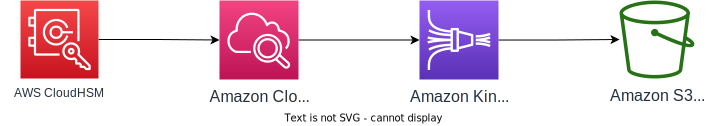
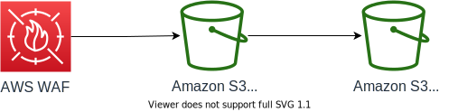
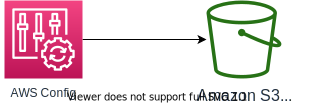
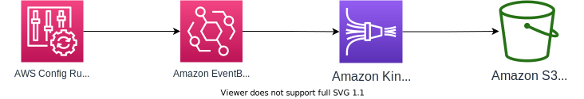
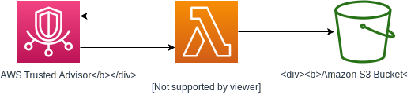
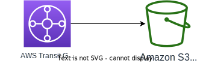
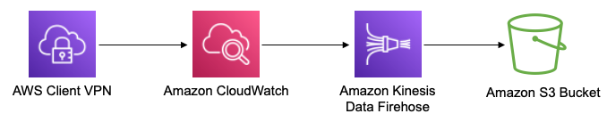
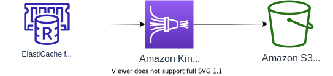

# AWS サービスの設定方法

[In English](configure_aws_service.md) | [READMEに戻る](../README_ja.md)

SIEM on Amazon OpenSearch Service に AWS の各サービスのログを取り込みます。下記を参考にしてログを取り込む AWS サービスを設定してください。

## 目次

1. [共通](#1-共通)
1. [セキュリティ、ID、およびコンプライアンス](#2-セキュリティIDおよびコンプライアンス)
    * [Amazon GuardDuty](#Amazon-GuardDuty)
    * [Amazon Inspector](#Amazon-Inspector)
    * [AWS CloudHSM](#AWS-CloudHSM)
    * [AWS Directory Service](#AWS-Directory-Service)
    * [AWS WAF](#AWS-WAF)
    * [AWS Security Hub](#AWS-Security-Hub)
    * [AWS Network Firewall](#AWS-Network-Firewall-Experimental-Support)
1. [管理とガバナンス](#3-管理とガバナンス)
    * [AWS CloudTrail](#AWS-CloudTrail)
    * [AWS Config](#AWS-Config)
    * [AWS Trusted Advisor](#AWS-Trusted-Advisor)
1. [ネットワーキングとコンテンツ配信](#4-ネットワーキングとコンテンツ配信)
    * [Amazon CloudFront](#Amazon-CloudFront)
    * [Route 53 Resolver VPC DNS Query Log](#Route-53-Resolver-VPC-DNS-Query-Log)
    * [Amazon Virtual Private Cloud (Amazon VPC) Flow Logs](#Amazon-VPC-Flow-Logs)
    * [AWS Transit Gateway](#AWS-Transit-Gateway)
    * [Elastic Load Balancing (ELB)](#Elastic-Load-Balancing-ELB)
    * [AWS Client VPN](#aws-client-vpn)
1. [ストレージ](#5-ストレージ)
    * [Amazon FSx for Windows File Server audit log](#Amazon-FSx-for-Windows-File-Server-audit-log)
    * [Amazon Simple Storage Service (Amazon S3) access log](#Amazon-S3-access-log)
1. [データベース](#6-データベース)
    * [RDS (Aurora MySQL互換 / MySQL / MariaDB)](#RDS-Aurora-MySQL互換--MySQL--MariaDB-Experimental-Support)
    * [RDS (Aurora PostgreSQL互換 / PostgreSQL)](#RDS-Aurora-PostgreSQL互換--PostgreSQL-Experimental-Support)
    * [Amazon ElastiCache for Redis](#Amazon-ElastiCache-for-Redis)
1. [分析](#7-分析)
    * [Amazon OpenSearch Service](#Amazon-OpenSearch-Service)
    * [Amazon Managed Streaming for Apache Kafka (Amazon MSK)](#Amazon-MSK)
1. [コンピューティング](#8-コンピューティング)
    * [EC2 インスタンス (Amazon Linux 2)](#EC2-インスタンス-Amazon-Linux-2)
    * [EC2 インスタンス (Microsoft Windows Server 2012/2016/2019)](#EC2-インスタンス-Microsoft-Windows-Server-201220162019)
1. [コンテナ](#9-コンテナ)
    * [Amazon ECS 対応 FireLens](#Amazon-ECS-対応-FireLens)
1. [エンドユーザーコンピューティング](#10-エンドユーザーコンピューティング)
    * [Amazon WorkSpaces](#Amazon-WorkSpaces)
1. [マルチリージョン・マルチアカウント](#11-マルチリージョンマルチアカウント)
1. [既存の S3 バケットからログからの取り込み](#12-既存の-S3-バケットからログからの取り込み)

## 1. 共通

SIEM on OpenSearch Service は Amazon Simple Storage Service (Amazon S3) の S3 バケットに出力されたファイル名とパス名からログ種別を判定しています。初期値は、各サービスのデフォルト設定による出力パスまたはファイル名です。デフォルト設定で判定できない場合は、判別可能な情報を付与した設定にしています。初期値とは異なるファイルパスで S3 に出力する場合は、user.ini を作成して "s3_key" の項目に独自のファイル名や S3 オブジェクトキーを追加してください。user.ini の編集方法は [SIEM on OpenSearch Service の設定変更](configure_siem_ja.md)を参照してください。

S3 バケットへの出力パスを自由に設定できる場合は、出力パス(プレフィックス)に AWS アカウント ID とリージョンを含めてください。取り込んだログにこの情報を付与します。ログにこの情報が含まれている場合には、ログに含まれている情報を優先します。

AWS Key Management Service (AWS KMS) による暗号化をして、S3 バケットにファイルを保存する場合は、SIEM on OpenSearch Serviceのデプロイ時に自動作成された AWS KMS カスタマーマネジメントキーをご利用ください。デフォルトではエイリアス名は aes-siem-key です。すでにある AWS KMS カスタマーマネジメントキーを利用することも可能で、その場合には [高度なデプロイ](deployment_ja.md) をご確認ください。

ここでの説明の AWS アカウントは **123456789012** としています。適宜、ご自身の AWS アカウントに置き換えてください。

## 2. セキュリティ、ID、およびコンプライアンス

### Amazon GuardDuty


s3_key の初期値: `GuardDuty` (デフォルト設定の出力パスの一部)

1. [GuardDuty コンソール](https://console.aws.amazon.com/guardduty/home?) に移動します
1. 画面左メニューの [**設定**] を選択します
1. [結果のエクスポートオプション] パネルへスクロールをして移動します
1. 更新された結果の頻度: [**15分ごとに CWE と S3 を更新する**] を選択して [**保存**] を選択します (推奨)
1. S3 バケットの [**今すぐ設定**] を選択して下記のパラメーターを入力します
    * [**既存のバケット お使いのアカウント内**] にチェックを入れます
    * バケットの選択: [**aes-siem-123456789012-log**] を選択します
        * 123456789012 は ご利用の AWS アカウント ID に置換してください
    * ログファイルのプレフィックス: 空欄のまま
    * KMS 暗号化: [**アカウントからキーを選択する**] にチェックを入れます
    * キーエイリアス: [**aes-siem-key**] を選択します
    * [**保存**] を選択します

以上で、設定は完了です。同じ設定画面内の [**結果サンプルの生成**] を選択すると SIEM on OpenSearch Service への取り込み設定の成否を確認できます。

### Amazon Inspector


s3_key の初期値: `Inspector2_Finding` (Firehose の出力パスに指定)

#### CloudFormation による設定 (Inspector)

| No | CloudFormation | 説明 |
|----------|----------------|---------------|
| 1 |[](https://console.aws.amazon.com/cloudformation/home#/stacks/create/template?stackName=log-exporter-core-resource&templateURL=https://aes-siem.s3.ap-northeast-1.amazonaws.com/siem-on-amazon-opensearch-service/v2.10.0-beta.3/log-exporter/siem-log-exporter-core.template) [link](https://aes-siem.s3.ap-northeast-1.amazonaws.com/siem-on-amazon-opensearch-service/v2.10.0-beta.3/log-exporter/siem-log-exporter-core.template) | 基本設定の CloudFormation。ログ転送先の S3 バケット名の取得や IAM ロールを作成します。他の AWS サービス設定で共通に使用します |
| 2 |[](https://console.aws.amazon.com/cloudformation/home#/stacks/new?stackName=log-exporter-eventbridge-events&templateURL=https://aes-siem.s3.ap-northeast-1.amazonaws.com/siem-on-amazon-opensearch-service/v2.10.0-beta.3/log-exporter/siem-log-exporter-eventbridge-events.template) [link](https://aes-siem.s3.ap-northeast-1.amazonaws.com/siem-on-amazon-opensearch-service/v2.10.0-beta.3/log-exporter/siem-log-exporter-eventbridge-events.template) | Firehose を作成。EventBridge を設定して Events を Firehose に配信します。Security Hub と Config Rules 共通のテンプレート。|

### AWS CloudHSM



s3_key の初期値: `/CloudHSM/` (Firehose の出力パスに指定)

#### CloudFormation による設定 (CloudHSM)

| No | CloudFormation | 説明 |
|----------|----------------|---------------|
| 1 |[](https://console.aws.amazon.com/cloudformation/home#/stacks/create/template?stackName=log-exporter-core-resource&templateURL=https://aes-siem.s3.ap-northeast-1.amazonaws.com/siem-on-amazon-opensearch-service/v2.10.0-beta.3/log-exporter/siem-log-exporter-core.template) [link](https://aes-siem.s3.ap-northeast-1.amazonaws.com/siem-on-amazon-opensearch-service/v2.10.0-beta.3/log-exporter/siem-log-exporter-core.template) | 基本設定の CloudFormation。ログ転送先の S3 バケット名の取得や IAM ロールを作成します。他の AWS サービス設定で共通に使用します |
| 2 |[](https://console.aws.amazon.com/cloudformation/home#/stacks/new?stackName=log-exporter-cloudhsm&templateURL=https://aes-siem.s3.ap-northeast-1.amazonaws.com/siem-on-amazon-opensearch-service/v2.10.0-beta.3/log-exporter/siem-log-exporter-cloudhsm-cwl.template) [link](https://aes-siem.s3.ap-northeast-1.amazonaws.com/siem-on-amazon-opensearch-service/v2.10.0-beta.3/log-exporter/siem-log-exporter-cloudhsm-cwl.template) | Firehose を作成。CloudWatch Logs subscription filters を設定して CloudWatch Logs を Firehose に配信し、Firehose 経由で S3 バケットにログを出力します。|

### AWS Directory Service


s3_key の初期値: `/DirectoryService/MicrosoftAD/` (Firehose の出力パスに指定)

1. [Directory Serviceコンソール](https://console.aws.amazon.com/directoryservicev2/home?)から CloudWatch Logs にログを出力します
1. 下記の CloudFormation を使って設定します
    * [siem-log-exporter-core.template](https://raw.githubusercontent.com/aws-samples/siem-on-amazon-opensearch-service/v2.10.0-beta.3/deployment/log-exporter/siem-log-exporter-core.template)
        * 基本設定の CloudFormation。ログ転送先のS3バケット名の取得やIAMロールを作成します。他の AWS サービス設定で共通に使用します

    * [siem-log-exporter-ad.template](https://raw.githubusercontent.com/aws-samples/siem-on-amazon-opensearch-service/v2.10.0-beta.3/deployment/log-exporter/siem-log-exporter-ad.template)
        * CloudWatch Logs から S3バケットに出力します

### AWS WAF




AWS WAF には AWS WAF と AWS WAF Classic の2つがあります。
AWS WAF Kinesis Data Firehose 経由で S3 バケットにエクスポートするか、WAF ログ用の S3 バケットにエクスポートしてから SIEM 用の S3 バケットにレプリケーションをして下さい。
AWS Classic は Kinesis Data Firehose 経由で S3 バケットに出力してください。

s3_key の初期値: `aws-waf-logs-` または `_waflogs_` (デフォルト設定の出力パスの一部)

AWS WAF を WAF 用の S3 バケットにエクスポートする方法は次の公式ドキュメントを参照して下さい。

[ウェブ ACL トラフィック情報のログ記録 / Amazon Simple Storage Service](https://docs.aws.amazon.com/ja_jp/waf/latest/developerguide/logging-s3.html)

Kinesis Data Firehose から S3 バケットにエクスポートする方法は以下の通りです。Kinesis Data Firehose の名前は [**aws-waf-logs-**] から始まることが条件となっており、この名前が S3 バケット出力時のファイル名に含まれているため、これをログ種類の判別に使用しています。

#### I. AWS WAF 共通設定

最初に Kinesis Data Firehose をデプロイします

1. [Kinesis コンソール](https://console.aws.amazon.com/kinesis/home?) に移動して、**AWS WAF がデプロイされたリージョン** を選択します
1. 画面左メニューの [**配信ストリーム**] を選択 => [**Create delivery stream**] を選択します
1. [New delivery stream] 画面にて次のパラメーターを入力します
    * Delivery stream name: [**aws-waf-logs-任意の名前**] を入力します
    * Source: [**Direct PUT or other sources**] にチェックを入れます
    * [**Next**] を選択します
1. [Process records] 画面にて次のパラメーターを入力します
    * Data transformation: [**Disabled**] を選択します
    * Record format conversion: [**Disabled**] を選択します
    * [**Next**] を選択します
1. [Choose a destination] 画面にて次のパラメーターを入力します
    * Destination: [**Amazon S3**] を選択します
    * S3 bucket: [**aes-siem-123456789012-log**] を入力します
        * 123456789012 は ご利用の AWS アカウント ID に置換してください
    * S3 prefix: [**AWSLogs/123456789012/WAF/[region]/**] を入力します
    * S3 error prefix: [**AWSLogs/123456789012/WAF/[region]/error/**] を入力します
        * 123456789012 と [region] は ご利用の AWS アカウント ID と リージョンに、置換してください。WAF をアタッチするリソースが CloudFront の時はリージョンを **global** としてください
1. [Configure settings] 画面にて次のパラメーターを入力します
    * Buffer size: [**任意の数字**] を入力します
    * Buffer interval: [**任意の数字**] を入力します
    * S3 compression: [**GZIP**] を選択します
    * 次以降はデフォルトのままします
    * [**Next**] を選択します
1. [**Create delivery stream**] を選択します

#### II. AWS WAF の Logging 設定

WAF Classic をお使いの場合はこのタスクはスキップしてください

1. [WAFv2 コンソール](https://console.aws.amazon.com/wafv2/home?) に移動します
1. 画面左メニューの [**Web ACLs**] を選択します
1. 画面中央のプルダウンから、WAF をデプロイした [**リージョン**] を選択 => ログ取得の対象 WAF の Name を選択します
1. [**Logging and metrics**] タブを選択 => [**Enable logging**] を選択します
1. [Amazon Kinesis Data Firehose Delivery Stream] のプルダウンから [**作成した Kinesis Firehose**] を選択します
1. [**Enable logging**] を選択して設定完了です

#### III. WAF Classic の Logging 設定

WAF をお使いの場合はこのタスクはスキップしてください

1. [WAF Classic コンソール](https://console.aws.amazon.com/waf/home?) に移動します
1. 画面左メニューの [**Web ACLs**] を選択します
1. 画面中央のプルダウンから、WAF をデプロイした [**リージョン**] を選択 => ログ取得の対象 WAF の Name を選択します
1. 画面右上の [**Logging**] タブを選択 => [**Enable logging**] を選択します
1. [Amazon Kinesis Data Firehose] のプルダウンから [**作成した Kinesis Firehose**] を選択します
1. [**Create**] を選択して設定完了です

### AWS Security Hub


s3_key の初期値: `SecurityHub` または `securityhub` (Firehose の出力パスに指定)

#### CloudFormation による設定 (Security Hub)

| No | CloudFormation | 説明 |
|----------|----------------|---------------|
| 1 |[](https://console.aws.amazon.com/cloudformation/home#/stacks/create/template?stackName=log-exporter-core-resource&templateURL=https://aes-siem.s3.ap-northeast-1.amazonaws.com/siem-on-amazon-opensearch-service/v2.10.0-beta.3/log-exporter/siem-log-exporter-core.template) [link](https://aes-siem.s3.ap-northeast-1.amazonaws.com/siem-on-amazon-opensearch-service/v2.10.0-beta.3/log-exporter/siem-log-exporter-core.template) | 基本設定の CloudFormation。ログ転送先の S3 バケット名の取得や IAM ロールを作成します。他の AWS サービス設定で共通に使用します |
| 2 |[](https://console.aws.amazon.com/cloudformation/home#/stacks/new?stackName=log-exporter-eventbridge-events&templateURL=https://aes-siem.s3.ap-northeast-1.amazonaws.com/siem-on-amazon-opensearch-service/v2.10.0-beta.3/log-exporter/siem-log-exporter-eventbridge-events.template) [link](https://aes-siem.s3.ap-northeast-1.amazonaws.com/siem-on-amazon-opensearch-service/v2.10.0-beta.3/log-exporter/siem-log-exporter-eventbridge-events.template) | Firehose を作成。EventBridge を設定して Events を Firehose に配信します。Security Hub と Config Rules 共通のテンプレート。|

#### 手動による設定 (Security Hub)

* ログ出力は Kinesis Data Firehose 経由となり、標準の保存パスがないので上記の s3_key を Kinesis Data Firehose の出力先 S3 バケットのプレフィックスに指定します
* 複数リージョンの Security Hub の findings を集約する時は、リージョン毎に、Firehose と EventBridge ルールを作成します

Kinesis Data Firehose の設定

1. [Kinesis コンソール](https://console.aws.amazon.com/kinesis/home?) に移動します
1. 画面左メニューの [**配信ストリーム**] を選択します
1. 画面左上の [**Create delivery stream**] を選択します
1. [New delivery stream] 画面にて次のパラメーターを入力します
    * Delivery stream name: [**aes-siem-firehose-securityhub**] を入力します
    * Source: [**Direct PUT or other sources**] にチェックを入れます
    * [Enable server-side encryption for source records in delivery stream] は任意です
    * [**Next**] を選択します
1. [Process records] 画面にて次のパラメーターを入力します
    * Data transformation: [**Disabled**] を選択します
    * Record format conversion: [**Disabled**] を選択します
    * [**Next**] を選択します
1. [Choose a destination] 画面にて次のパラメーターを入力します
    * Destination: [**Amazon S3**] を選択します
    * S3 bucket: [**aes-siem-123456789012-log**] を入力します
    * S3 prefix: [**AWSLogs/123456789012/SecurityHub/[region]/**] を入力します
    * S3 error prefix: [**AWSLogs/123456789012/SecurityHub/[region]/error/**] を入力します
        * 123456789012 と [region] は ご利用の AWS アカウント ID と リージョンに、置換してください
1. [Configure settings] 画面にて次のパラメーターを入力します
    * Buffer size: [**任意の数字**] を入力します
    * Buffer interval: [**任意の数字**] を入力します
    * S3 compression: [**GZIP**] を選択します
    * 次以降はデフォルトのまま
    * [**Next**] を選択します
1. [**Create delivery stream**] を選択して Kinesis Data Firehose のデプロイ完了です

EventBridge の設定

1. [EventBridge コンソール](https://console.aws.amazon.com/events/home?) に移動します
1. 画面左メニューの [**ルール**] を選択 => [**ルールの作成**] を選択します
1. [ルールを作成] 画面にて次のパラメーターを入力します
    * 名前: aes-siem-securityhub-to-firehose
    * パターンを定義: イベントパターンを選択します
    * イベント一致パターン: サービスごとの事前定義パターン
    * サービスプロバイダー: AWS
    * サービス名: Security Hub
    * イベントタイプ: Security Hub Findings - Imported
    * [イベントバスを選択]パネルは変更なし
    * ターゲット: Firehose 配信ストリーム
    * ストリーム: aes-siem-firehose-securityhub
    * 他は任意の値を選択します
    * [**作成**] を選択を選択して完了です

### AWS Network Firewall (Experimental Support)


s3_key の初期値: `_network-firewall_` (デフォルト設定の出力パスの一部)

Amazon Network Firewall のログを下記の方法で [**S3 バケット**] に出力します

1. [VPC コンソール](https://console.aws.amazon.com/vpc/home?) に移動します
1. 画面左メニューの [**ファイアウォール**] を選択します
1. [**対象のファイアウォール**] を選択します
1. 概要パネルの下にあるタブメニューの [**ファイアウォールの詳細**] を選択します
1. ログ記録のパネルの [**編集**] を選択します
    * ログタイプの [**Alert**] と [**Flow**] にチェックを入れます
    * **アラートのログ送信先**と**フローのログ送信先**のそれぞれで S3 バケットにチェックを入れます
    * Amazon S3 バケット: [**aes-siem-123456789012-log**] を入力します
        * 123456789012 は ご利用の AWS アカウント ID に置換してください
    * プレフィックス - オプション: 空欄のまま
1. [**保存**] を選択して、設定完了です

参考: [AWS Network Firewall - Developer Guide - Logging and monitoring in AWS Network Firewall(S3)](https://docs.aws.amazon.com/ja_jp/network-firewall/latest/developerguide/logging-s3.html)

## 3. 管理とガバナンス

### AWS CloudTrail


s3_key の初期値: `CloudTrail/` または `CloudTrail-Insight/` (デフォルト設定の出力パスの一部)

CloudTrail のログを下記の方法で S3 バケットに出力してください。

1. [CloudTrail コンソール](https://console.aws.amazon.com/cloudtrail/home?) に移動します
1. 画面左メニューの [**証跡**] => 画面右上の [**証跡の作成**] を選択します
1. [証跡属性の選択] 画面で次のパラメータを入力します
    * 証跡名: [**aes-siem-trail**]
    * 組織内の全てのアカウントについて有効化: 任意。グレーアウトしてチェックできない場合はスキップします
    * ストレージの場所: [**既存の S3 バケットを使用する**] にチェックします
    * [**aes-siem-123456789012-log**] を選択します
        * 123456789012 はご利用の AWS アカウント ID に置換してください
    * ログファイルの SSE-KMS 暗号化: [**有効**] にチェックを入れることを推奨します
    * AWS KMS カスタマー管理の CMK: [**既存**] にチェックします
    * AWS KMS エイリアス： [**aes-siem-key**] を選択します
    * ログファイルの検証: [**有効**] にチェックを入れることを推奨します
    * SNS 通知の配信: 有効にチェックせず
    * CloudWatch Logs: 有効にチェックせず
    * タグオプション: 任意です
1. [**次へ**] を選択
1. [ログイベントの選択] 画面で次のパラメーターを入力します
    * イベントタイプ
        * 管理イベント: [**チェックします*]
        * データイベント: 任意です
        * Insights イベント: 任意です
    * 管理イベント
        * APIアクティビティ: [読み取り]と[書き込み] の両方にチェックします
        * AWS KMS イベントの除外: 任意です
1. [**次へ**] を選択します
1. [**証跡の作成**] を選択して設定完了です

### AWS Config

#### Configuration 履歴 / Configuration スナップショット



* Configuration 履歴: s3_key の初期値: `_ConfigHistory_` (デフォルト設定の出力パスの一部)
* Configuration スナップショット: s3_key の初期値: `_ConfigSnapshot_` (デフォルト設定の出力パスの一部)

S3 バケットの出力方法はデベロッパーガイド [コンソールによる AWS Config の設定](https://docs.aws.amazon.com/ja_jp/config/latest/developerguide/gs-console.html) の 「配信方法」を参照してください。S3 バケットの指定には SIEM のログバケットを選択してください。

#### Config Rules



s3_key の初期値: `Config.*Rules` (Firehose の出力パスに指定)

#### CloudFormation による設定 (Config Rules)

| No | CloudFormation | 説明 |
|----------|----------------|---------------|
| 1 |[](https://console.aws.amazon.com/cloudformation/home#/stacks/create/template?stackName=log-exporter-core-resource&templateURL=https://aes-siem.s3.ap-northeast-1.amazonaws.com/siem-on-amazon-opensearch-service/v2.10.0-beta.3/log-exporter/siem-log-exporter-core.template) [link](https://aes-siem.s3.ap-northeast-1.amazonaws.com/siem-on-amazon-opensearch-service/v2.10.0-beta.3/log-exporter/siem-log-exporter-core.template) | 基本設定の CloudFormation。ログ転送先の S3 バケット名の取得や IAM ロールを作成します。他の AWS サービス設定で共通に使用します |
| 2 |[](https://console.aws.amazon.com/cloudformation/home#/stacks/new?stackName=log-exporter-eventbridge-events&templateURL=https://aes-siem.s3.ap-northeast-1.amazonaws.com/siem-on-amazon-opensearch-service/v2.10.0-beta.3/log-exporter/siem-log-exporter-eventbridge-events.template) [link](https://aes-siem.s3.ap-northeast-1.amazonaws.com/siem-on-amazon-opensearch-service/v2.10.0-beta.3/log-exporter/siem-log-exporter-eventbridge-events.template) | Firehose を作成。EventBridge を設定して Events を Firehose に配信します。Security Hub と Config Rules 共通のテンプレート。|

### AWS Trusted Advisor



s3_key の初期値: `(TrustedAdvisor|trustedadvisor)` Lambda functionにより固定値で出力されるので設定不要。

#### CloudFormation による設定 (Trusted Advisor)

※ Trusted Advisor の結果を収集するためには、AWS のサポートプランが、ビジネスサポート、エンタープライズ On-Ramp サポート、エンタープライズサポートのいずれかである必要があります。詳細は[AWS Support プラン比較](https://aws.amazon.com/jp/premiumsupport/plans/)を参照してください。

| No | CloudFormation | 説明 |
|----------|----------------|---------------|
| 1 |[](https://console.aws.amazon.com/cloudformation/home#/stacks/create/template?stackName=log-exporter-core-resource&templateURL=https://aes-siem.s3.ap-northeast-1.amazonaws.com/siem-on-amazon-opensearch-service/v2.10.0-beta.3/log-exporter/siem-log-exporter-core.template) [link](https://aes-siem.s3.ap-northeast-1.amazonaws.com/siem-on-amazon-opensearch-service/v2.10.0-beta.3/log-exporter/siem-log-exporter-core.template) | 基本設定の CloudFormation。ログ転送先の S3 バケット名の取得や IAM ロールを作成します。他の AWS サービス設定で共通に使用します |
| 2 |[](https://console.aws.amazon.com/cloudformation/home#/stacks/new?stackName=log-exporter-trustedadvisor&templateURL=https://aes-siem.s3.ap-northeast-1.amazonaws.com/siem-on-amazon-opensearch-service/v2.10.0-beta.3/log-exporter/siem-log-exporter-trustedadvisor.template) [link](https://aes-siem.s3.ap-northeast-1.amazonaws.com/siem-on-amazon-opensearch-service/v2.10.0-beta.3/log-exporter/siem-log-exporter-trustedadvisor.template) | Lambda を作成。EventBridge を設定して Lambda を定期実行し、Trusted Advisor チェック結果 を S3 に書き出します。|

## 4. ネットワーキングとコンテンツ配信

### Amazon CloudFront

CloudFront には、ディストリビューションに送信されるリクエストを2つの方法で記録できます。標準ログ (アクセスログ)とリアルタイムログです。2つの違いは、[こちら](https://docs.aws.amazon.com/ja_jp/AmazonCloudFront/latest/DeveloperGuide/logging.html)をご確認ください。

#### I. CloudFront 標準ログ (アクセスログ)


s3_key の初期値: `(^|\/)[0-9A-Z]{12,14}\.20\d{2}-\d{2}-\d{2}-\d{2}.[0-9a-z]{8}\.gz$$`

ログ種別はデフォルト設定の出力ファイル名を正規表現で判別。ログには AWS アカウント ID が含まれていないので S3 のプレフィックスに含めてください。

1. [CloudFront コンソール](https://console.aws.amazon.com/cloudfront/home?) に移動します
1. 画面左メニューの [**Logs**] を選択 => [**Distribution logs**] タブを選択します
1. ログを取り込みたい [**Distribution ID**] を選択します
1. [Standard logs] タイトルの右にある [**Edit**] を選択します
1. ポップアップした [Edit standard logs] 画面に次のパラメーターを入力します
    * Standard logs を [**Enabled**] にします
    * S3 bucket: [**aes-siem-123456789012-log**] を入力します
        * 123456789012 は ご利用の AWS アカウント ID に置換してください
    * S3 bucket prefix: [**AWSLogs/123456789012/CloudFront/global/ディストリビューションID/standard/**] を入力します
        * ご利用の AWS アカウント ID と CloudFront のディストリビューション ID に置換してください
    * Cookie logging: [**Yes**] にします
    * [**Update**] を選択して設定完了です

#### II.  CloudFront リアルタイムログ


CloudFront リアルタイムログは、Amazon Kinesis Data Streams で選択したデータストリームに配信されます。その後、Amazon Kinesis Data Firehose を使用して、ログデータを Amazon S3 に送信します。

s3_key の初期値: `CloudFront/.*/realtime/` (Firehose の出力パスに指定)

リアルタイムログには、標準の保存パスがないので上記の S3 パスをプレフィックスで指定してください。 .* (ピリオドとアスタリスク) は自由な文字を入れられますのでリージョン等を含めてください。CloudFront のログには AWS アカウント ID と ディストリビューションID が含まれていないので S3 のプレフィックスに、この2つを含めるようにしてください。

次の順番で設定します。

1. Kinesis Data Stream
1. Kinesis Data Firehose
1. CloudFront

Kinesis Data Stream と Kinesis Data Firehose の設定

1. [Kinesis コンソール](https://console.aws.amazon.com/kinesis/home?region=us-east-1) に移動し、**バージニア北部リージョン** を選択します
1. 画面左メニューの [**データストリーム**] を選択 => [**データストリームの作成**] を選択します
1. [データストリームの作成] 画面にて次のパラメーターを入力します
    * データストリーム名: [**任意の名前**] を入力します
    * 開いているシャードの数: [**任意のシャード数**] を入力します
    * [**データストリームの作成**] を選択します
1. 続けて Kinesis Data Firehose の設定します。作成したデーターストリームのステータスが [アクティブ] になるまで待ってから、画面下の [コンシューマー] パネルの [**配信ストリームを使用した処理**] を選択します
1. [New delivery stream] 画面にて次のパラメーターを入力します
    * Delivery stream name: [**任意の名前**] を入力します
    * Source: [**Kinesis Data Stream**] にチェックを入れます
    * Kinesis data stream: [**1つ前で作成した Kinesis Data Stream**] を選択します
    * [**Next**] を選択します
1. [Process records] 画面にて次のパラメーターを入力します
    * Data transformation: [**Disabled**] を選択します
    * Record format conversion: [**Disabled**] を選択します
    * [**Next**] を選択します
1. [Choose a destination] 画面にて次のパラメーターを入力します
    * Destination: [**Amazon S3**] を選択します
    * S3 bucket: [**aes-siem-123456789012-log**] を入力します
        * 123456789012 は ご利用の AWS アカウント ID に置換してください
    * S3 prefix: [**AWSLogs/123456789012/CloudFront/global/ディストリビューションID/realtime/**] を入力します
        * 123456789012 は ご利用の AWS アカウント ID に置換してください
    * S3 error prefix: [**AWSLogs/123456789012/CloudFront/global/ディストリビューションID/realtime/error/**] を入力します
1. [Configure settings] 画面にて次のパラメーターを入力します
    * Buffer size: [**任意の数字**] を入力します
    * Buffer interval: [**任意の数字**] を入力します
    * S3 compression: [**GZIP**] を選択します
    * 次以降はデフォルトのままです
    * [**Next**] を選択します
1. [**Create delivery stream**] を選択します

CloudFront の設定

1. [CloudFront コンソール](https://console.aws.amazon.com/cloudfront/home?) に移動します
1. 画面左メニューの [**Logs**] を選択 => [**Real-time log configurations**]タブを選択します
1. 画面右の[**Create configuration**] を選択します
1. [Create real-time log configuration] 画面に次のパラメーターを入力します
    * Name: [**任意の名前**] を入力します
    * Sampling rate: [**100**]
        * 全てのログを SIEM on OpenSearch Service に取り込みます
    * Fields: [**全てのフィールドにチェックを入れてください**]
        * デフォルトで全てがチェックされています
    * Endpoint:  [**2つ前で作成した Kinesis Data Stream**] を選択します
    * IAM role: [**Create new service role CloudFrontRealtimeLogConfiguRole-XXXXXXXXXXXX**] を選択します
    * Distribution: [**対象のDistribution**] を選択します
    * Cache behavior(s): [**Default(*)**] を選択します
1. [**Create configuration**] を選択して設定完了です

### Route 53 Resolver VPC DNS Query Log


s3_key の初期値: `vpcdnsquerylogs` (デフォルト設定の出力パスの一部)

1. [Route 53 Resolver コンソール](https://console.aws.amazon.com/route53resolver/home?) に移動します
1. 画面左メニューの [**クエリのログ記録**] を選択します
1. [クエリログ記録の設定] 画面で次のパラメータを入力します
    * 名前: [**任意の名前**] を入力します
    * クエリログの送信先: [**S3 バケット**] を選択します
    * Amazon S3 バケット: [**aes-siem-123456789012-log**] を選択します
        * 123456789012 は ご利用の AWS アカウント ID に置換してください
    * クエリをログ記録するVPC: [**任意のVPCを追加**]
1. [**クエリログの設定**] を選択して設定完了です

### Amazon VPC Flow Logs


s3_key の初期値: `vpcflowlogs` (デフォルト設定の出力パスの一部)

VPC Flow Logs を下記の方法で S3 バケットに出力してください。

1. [VPC コンソール](https://console.aws.amazon.com/vpc/home?) に移動します
1. 画面左メニューの [**VPC**] または [**サブネット**] を選択 => ログ取得対象リソースのチェックボックスを選択します
1. 画面下部の詳細情報の、[**フローログ**] タブを選択 => [**フローログの作成**] を選択します
1. [フローログを作成]画面にて下記のパラメーターを入力します
    * 名前: 任意
    * フィルタ: 任意、[**すべて**] を推奨します
    * 最大集約間隔: 任意、1分間にするとログ量が増えます
    * 送信先: [**S3 バケットへの送信**] にチェックを入れます
    * S3 バケット ARN: [**arn:aws:s3:::aes-siem-123456789012-log**]
        * 123456789012 は ご利用の AWS アカウント ID に置換してください
    * ログレコード形式: [**AWS のデフォルトの形式**] またはカスタム形式を選択してフィールドにチェックを入れます
    * タグ: 任意
1. [**フローログを作成**] を選択して設定完了です

### AWS Transit Gateway



s3_key の初期値: `vpcflowlogs` (デフォルト設定の出力パスの一部)

VPC Flow Logs を下記の方法で S3 バケットに出力してください。

1. [VPC コンソール](https://console.aws.amazon.com/vpc/home?) に移動します
1. 画面左メニューの [**Transit Gateway**] または [**Transit Gateway アタッチメント**] を選択 => ログ取得対象リソースのチェックボックスを選択します
1. 画面下部の詳細情報の、[**フローログ**] タブを選択 => [**フローログの作成**] を選択します
1. [フローログを作成]画面にて下記のパラメーターを入力します
    * 名前: 任意
    * 送信先: [**S3 バケットへの送信**] にチェックを入れます
    * S3 バケット ARN: [**arn:aws:s3:::aes-siem-123456789012-log**]
        * 123456789012 は ご利用の AWS アカウント ID に置換してください
    * ログレコード形式: [**AWS のデフォルトの形式**] またはカスタム形式を選択してフィールドにチェックを入れます
    * ログファイル形式: テキスト または Parquet
    * Hive 互換 S3 プレフィックス: 任意
    * 時間別にログをパーティション化: 任意
    * タグ: 任意
1. [**フローログを作成**] を選択して設定完了です

### Elastic Load Balancing (ELB)


次の3つのロードバランサーのログについて、それぞれを S3 バケットに出力します。

* Application Load Balancer(ALB)
* Network Load Balancer(NLB)
* Classic Load Balancer(CLB)

s3_key の初期値はデフォルトの出力パスとファイル名を正規表現で判別します

* ALB: `elasticloadbalancing_.*T\d{4}Z_\d{1,3}\.\d{1,3}\.\d{1,3}\.\d{1,3}_\w*\.log\.gz$$`
* NLB: `elasticloadbalancing_.*T\d{4}Z_[0-9a-z]{8}\.log\.gz$$`
* CLB: `elasticloadbalancing_.*T\d{4}Z_\d{1,3}\.\d{1,3}\.\d{1,3}\.\d{1,3}_\w*\.log$$`

1. [EC2 コンソール](https://console.aws.amazon.com/ec2/home?) に移動します
1. 画面左メニューの [**ロードバランサー**] を選択 => ログ取得の対象ロードバランサーの [**チェックボックスを選択**] します
1. [説明] タブを選択 => ALB/NLB/CLBでそれぞれの方法を次のパラメータを入力します
    * ALB/NLBの場合: [**属性の編集**] を選択します
        * アクセスログ: [**有効化**] にチェックを入れます
        * S3 の場所: [**aes-siem-123456789012-log**] を入力します
            * 123456789012 は ご利用の AWS アカウント ID に置換してください
        * この場所の作成: チェックをしません
        * [**保存**] を選択します
    * CLBの場合: [**アクセスログの設定**]を選択します
        * アクセスログの有効化: [**チェックを入れます**]
        * 間隔: [**5分 or 60分**] のどちらかを選択します
        * S3 の場所: [**aes-siem-123456789012-log**] を入力します
            * 123456789012 は ご利用の AWS アカウント ID に置換してください
        * この場所の作成: チェックをせず
        * [**保存**] を選択して設定完了です

### AWS Client VPN



s3_key の初期値: `/ClientVPN/` (Firehose の出力パスに指定)

ClientVPNのログはまずCloudWatch Logsに送信し，その後はAmazon Kinesis Data Firehose経由してS3バケットに出力します。
ClientVPNログはCloudWatch Logsに送信するのは手動による設定必要です。CLoudWatchからS3バケットに出力するのはCloudFormationによる展開できます。

#### I.手動による設定(CloudWatchに出力の準備）

1. [CloudWatch コンソール](https://console.aws.amazon.com/cloudwatch/home?)に移動します。
    1. **ロググループ** を選択し、**ロググループを作成** をクリックします。
    1. ロググループを作成。**ロググループ名** を `/aws/clientvpn` として、それ以外はデフォルトで、作成をクリックします。
1. [VPC コンソール](https://console.aws.amazon.com/vpc/home?) に移動します。
    1. 左側ペインから **クライアント VPN エンドポイント** を選択し、**クライアント VPN エンドポイントの作成** をクリックします。
    1. **CloudWatch Logsロググループ名** に `/aws/clientvpn` を選択すればCloudWatch Logsに出力の準備は完了です。

#### II.CloudFormation による S3 バケットへの出力設定 (ClientVPN)

| No | CloudFormation | 説明 |
|----------|----------------|---------------|
| 1 |[](https://console.aws.amazon.com/cloudformation/home#/stacks/create/template?stackName=log-exporter-core-resource&templateURL=https://aes-siem.s3.ap-northeast-1.amazonaws.com/siem-on-amazon-opensearch-service/v2.10.0-beta.3/log-exporter/siem-log-exporter-core.template) [link](https://aes-siem.s3.ap-northeast-1.amazonaws.com/siem-on-amazon-opensearch-service/v2.10.0-beta.3/log-exporter/siem-log-exporter-core.template) | 基本設定の CloudFormation。ログ転送先の S3 バケット名の取得や IAM ロールを作成します。他の AWS サービス設定で共通に使用します |
| 2 |[](https://console.aws.amazon.com/cloudformation/home#/stacks/new?stackName=log-exporter-clientvpn&templateURL=https://aes-siem.s3.ap-northeast-1.amazonaws.com/siem-on-amazon-opensearch-service/v2.10.0-beta.3/log-exporter/siem-log-exporter-clientvpn.template) [link](https://aes-siem.s3.ap-northeast-1.amazonaws.com/siem-on-amazon-opensearch-service/v2.10.0-beta.3/log-exporter/siem-log-exporter-clientvpn.template) | Firehose を作成。CloudWatch Logs subscription filters を設定して CloudWatch Logs を Firehose に配信し、Firehose 経由で S3 バケットにログを出力します。|

以上設定完了です。
参考：[AWS Client VPN Basic ハンズオン](https://catalog.us-east-1.prod.workshops.aws/workshops/be2b90c2-06a1-4ae6-84b3-c705049d2b6f/ja-JP)

## 5. ストレージ

### Amazon FSx for Windows File Server audit log


s3_key の初期値: `aws-fsx-`

Amazon FSx 監査ログを Kinesis Data Firehose から S3 バケットにエクスポートします。Kinesis Data Firehose の名前は [**aws-fsx-**] から始まることが条件となっており、この名前が S3 バケット出力時のファイル名に含まれているため、これをログ種類の判別に使用しています。

1. 下記の CloudFormation を使って設定します
    * [siem-log-exporter-core.template](https://raw.githubusercontent.com/aws-samples/siem-on-amazon-opensearch-service/v2.10.0-beta.3/deployment/log-exporter/siem-log-exporter-core.template)
        * 基本設定の CloudFormation。ログ転送先のS3バケット名の取得やIAMロールを作成します。他の AWS サービス設定で共通に使用します

    * [siem-log-exporter-fsx.template](https://raw.githubusercontent.com/aws-samples/siem-on-amazon-opensearch-service/v2.10.0-beta.3/deployment/log-exporter/siem-log-exporter-fsx.template)
        * Firehose を作成してから S3 バケットに出力します。Firehoseの名前は、aws-fsx-XXXXXX としてください。XXXXXは任意の文字列です。
1. [FSxコンソール](https://console.aws.amazon.com/fsx/home?)から Firehose にログを出力してください

### Amazon S3 access log


S3 access log を下記の方法で S3 バケットに出力してください。すでに CloudTrail の データイベントで S3 を取得している場合、S3 access log との違いは [こちら](https://docs.aws.amazon.com/ja_jp/AmazonS3/latest/dev/logging-with-S3.html) をご確認ください

s3_key の初期値: `/20\d{2}-[01]\d-\d{2}-\d{2}-\d{2}-\d{2}-[0-9A-Z]{16}$$` (s3_key の初期値はデフォルトのファイル名を正規表現で判別します)

1. [S3 コンソール](https://console.aws.amazon.com/s3/home?) に移動します
1. バケットの一覧からログを取得したい S3 バケットを選択します
1. [**プロパティ**]タブを選択 => [**サーバーアクセスのログ記録**]を選択します
    1. [**ログの有効化**]にチェックを入れます
    1. ターゲットバケット: [**aes-siem-123456789012-log**] を選択します
        * 123456789012 は ご利用の AWS アカウント ID に置換してください
    1. ターゲットプレフィックス: [**AWSLogs/AWSアカウントID/s3accesslog/リージョン/バケット名/**]
    1. [**保存**] を選択します

## 6. データベース

### RDS (Aurora MySQL互換 / MySQL / MariaDB) (Experimental Support)


以下のログを Cloud Watch Logs に出力して、SIEM に取り込みます。

* エラーログ (Error log)
* スロークエリログ (Slow query log)
* 一般ログ (General log)
* 監査ログ (Audit log)

s3_key の初期値は以下です。Firehose の出力パスに指定してください。

* エラーログ: `(MySQL|mysql|MariaDB|mariadb).*(error)`
* スロークエリログ: `(MySQL|mysql|MariaDB|mariadb).*(slowquery)`
* 一般ログ: `(MySQL|mysql|MariaDB|mariadb).*(general)`
* 監査ログ: `(MySQL|mysql|MariaDB|mariadb).*(audit)`

監査ログを Firehose で指定するの S3 出力先のプレフィックス例: `AWSLogs/123456789012/RDS/mysql/audit/ap-northeast-1`

#### RDS (Aurora MySQL互換 / MySQL / MariaDB) の設定

1. [RDS コンソール](https://console.aws.amazon.com/rds/home?) に移動します
1. RDS で Audit ログを有効にするためにオプショングループから監査プラグインの設定をします。設定できる Database エンジンとバージョンは下記を参照して下さい。(Aurora は、パラメーターグループで設定するので、この設定は不要です)。
    * [MariaDB - MariaDB データベースエンジンのオプション](https://docs.aws.amazon.com/ja_jp/AmazonRDS/latest/UserGuide/Appendix.MariaDB.Options.html)
    * [MySQL - MariaDB 監査プラグインのサポート](https://docs.aws.amazon.com/ja_jp/AmazonRDS/latest/UserGuide/Appendix.MySQL.Options.AuditPlugin.html)
    1. RDS で Audit ログ を有効にするオプション設定が可能で必要な場合は、画面左メニューの [**オプショングループ**] => 画面右上の [**グループの作成**] を選択します
        * 名前: aes-siem-option-mysqlXX
        * 説明: aes-siem-option-mysqlXX など
        * エンジン: お使いのDBエンジン (mariadb または mysql)を選択します
        * メジャーバージョン: お使いのバージョンを選択します
    1. [**作成**] を選択
    1. 作成したオプショングループ [**aes-siem-option-mysqlXX**] を選択します
    1. 画面を下にスクロールして、オプションペインの [**オプションの追加**] を選択します
    1. 以下のパラメーターを入力します。(適宜、取得したいログを選択)

        |パラメータ|設定値|説明|デフォルト値(参考)|
        |----------|------|----|------------------|
        |SERVER_AUDIT_EVENTS|CONNECT,QUERY_DDL,QUERY_DCL|接続とDDLのみを監査ログとしてログに保存します|Null、無効化|
        |SERVER_AUDIT_EXCL_USERS|rdsadmin|指定したユーザーからのアクティビティを除外|Null, なし|

    1. [**保存**]を選択。[**すぐに適用**] は影響をご確認の上、判断してください。
1. パラメーターグループで各ログの出力設定をします
    1. 画面左メニューの [**パラメータグループ**] => 画面右上の [**パラメータグループの作成**] を選択します
    1. ログ: [パラメータグループの作成] の画面にて次のパラメーターを入力します
        * パラメータグループファミリー: aurora-mysqlXX または mariadbXX または mysqlXX
            * お使いの DB エンジンと XX はバージョンを選択します
        * タイプ: DB Parameter Group または、Aurora は DB Cluster Parameter Group
        * グループ名: aes-siem-mysqlXX など
        * 説明: aes-siem-mysqlXX など
    1. [**作成**] を選択
    1. 作成したパラメーターグループ [**aes-siem-mysqlXX**] を選択して、以下のパラメーターを入力(適宜、取得したいログを選択しパラメーターを変更して下さい)

        |パラメータ|設定値|説明|デフォルト値(参考)|
        |----------|------|----|------------------|
        |general_log|1 (有効化)|一般ログを有効にします|Null、無効化|
        |slow_query_log|1 (有効化)|スロークエリログを有効にします|Null, 無効化|
        |server_audit_logging|1 (有効化)| Aurora のみ設定可。監査ログを有効にします|Null, 有効化|
        |server_audit_excl_users|rdsadmin|Aurora のみ設定可。指定したユーザーからのアクティビティを除外|Null, なし|
        |server_audit_events|CONNECT,QUERY_DDL,QUERY_DCL|Aurora のみ設定可。接続とDDLのみを監査ログとしてログに保存します|Null、無効化|
        |long_query_time|10 (秒)|ログに記録されるクエリの最短実行時間の値を秒単位で指定します|10 (秒)|
        |log_output|FILE|ログをファイルシステムに書き込み、CloudWatch Logs に発行させます|FILE or TABLE|

    1. [**変更の保存**] を選択

1. データーベースへの設定
    1. 画面左のメニューで、[データベース] を選択します
    1. ログデータを出力する MariaDB / MySQL のインスタンス、または Aurora MySQL DB クラスターを選択します
    1. [**変更**] を選択します
    1. [追加設定] セクションから DB パラメーターグループと オプショングループに上記で作成したグループをそれぞれを選択します
    1. [ログのエクスポート] セクションで、CloudWatch Logs に公開するログを選択します
        * 監査ログ、エラーログ、全般ログ、スロークエリログ
    1. 画面右下の[続行] を選択
    1. すぐに適用を選択してから、[**DBインスタンスを変更**] を選択

#### CloudWatch Logs サブスクリプションフィルタ および Firehoseの 設定 (Aurora MySQL互換 / MySQL / MariaDB)

ログ種類毎に CloudWatch Logs に出力されます。各種類毎に Firehose を作成して、CloudWatch Logs サブスクリプションフィルタ でS3に出力してください。

設定手順は、こちらのサイトを参考に設定してください。[CloudWatch Logs サブスクリプションフィルタの使用-例 3: Amazon Kinesis Data Firehose のサブスクリプションフィルタ](https://docs.aws.amazon.com/ja_jp/AmazonCloudWatch/latest/logs/SubscriptionFilters.html#FirehoseExample)

※※ **S3 バケットへの出力時に、圧縮設定はしないで下さい。** CloudWatch Logsから受信する場合はすでに gzip 圧縮されているので二重圧縮となり適切に処理ができません ※※

#### 参考サイト (Aurora MySQL互換 / MySQL / MariaDB)

* [Auroraユーザーガイド MySQL データベースログファイル](https://docs.aws.amazon.com/ja_jp/AmazonRDS/latest/AuroraUserGuide/USER_LogAccess.Concepts.MySQL.html)
* [RDS ユーザーガイド MySQL データベースログファイル](https://docs.aws.amazon.com/ja_jp/AmazonRDS/latest/UserGuide/USER_LogAccess.Concepts.MySQL.html)
* [RDS ユーザーガイド MariaDB データベースのログファイル](https://docs.aws.amazon.com/ja_jp/AmazonRDS/latest/UserGuide/USER_LogAccess.Concepts.MariaDB.html)
* [Amazon Aurora MySQL DB クラスターでの高度な監査の使用](https://docs.aws.amazon.com/ja_jp/AmazonRDS/latest/AuroraUserGuide/AuroraMySQL.Auditing.html#AuroraMySQL.Auditing.Logs)
* [Amazon RDS または Aurora for MySQL インスタンスのログを CloudWatch に公開するにはどうすれば良いですか?](https://aws.amazon.com/jp/premiumsupport/knowledge-center/rds-aurora-mysql-logs-cloudwatch/)
* [Amazon RDS MySQL または MariaDB インスタンスの監査ログを有効にして、そのログを CloudWatch に公開する方法を教えてください。](https://aws.amazon.com/jp/premiumsupport/knowledge-center/advanced-audit-rds-mysql-cloudwatch/)

### RDS (Aurora PostgreSQL互換 / PostgreSQL) (Experimental Support)


s3_key の初期値: `Postgre` or `postgre` (Firehose の出力パスに指定)

Firehose で指定するの S3 出力先のプレフィックス例: `AWSLogs/123456789012/RDS/postgresql/ap-northeast-1`

#### RDS (Aurora PostgreSQL互換 / PostgreSQL) の設定

1. [RDS コンソール](https://console.aws.amazon.com/rds/home?) に移動します
1. 出力するログの種類をパラメーターグループで設定します
    1. 画面左メニューの [**パラメータグループ**] => 画面右上の [**パラメータグループの作成**] を選択します
    1. ログ: [パラメータグループの作成] の画面にて次のパラメーターを入力します
        * パラメータグループファミリー: aurora-postgresqlXX または postgresXX
            * XX はお使いのバージョンを選択します
        * タイプ: DB Parameter Group または、Aurora は DB Cluster Parameter Group
        * グループ名: aes-siem-postgresqlXX
        * 説明: aes-siem-postgresqlXX
    1. [**作成**] を選択します
    1. 作成したパラメーターグループ [**aes-siem-postgresqlXX**] を選択して、以下のパラメーターを入力します。適宜、取得したいログを選択してください。

        |パラメータ|設定値|説明|デフォルト値(参考)|
        |----------|------|----|------------------|
        |log_min_duration_statement|10000|スロークエリログの記録。設定値以上(ミリ秒)のクエリーを全て記録。10000ミリ秒(10秒)以上を対象|-1,無効化|
        |log_statement|ddl|実行時間に関わらず、DDL (CREATE や DROP 等) をログに記録する|None|
        |log_statement_stats|1 (有効化)|Statementに関する統計情報を出力|0,無効化|
        |log_lock_waits|1 (有効化)|デッドロックのタイムアウトよりロックに時間を要した場合、ログメッセージを生成|0,無効化|
        |log_checkpoints|1 (有効化)|チェックポイントを記録。パラメーターがなければ設定不要|0,無効化|
        |log_connections|1 (有効化)|クライアント認証の成功終了などのサーバへの接続試行を出力|0,無効化|
        |log_disconnections|1 (有効化)|セッション終了時にセッション時間を出力|0,無効化|

        * ※その他のパラメーターの変更は、正常にログの取り込みやダッシュボードの表示ができない可能性があります
    1. [**変更の保存**] を選択
1. データーベースにパラメータを適用します。
    1. 画面左メニューの [**データベース**] => 対象の Aurora のクラスター、または RDS インスタンスを選択し、[**変更**]を選択します
        * パラメーターグループの aes-siem-postgresqlXX を選択します
        * ログのエクスポート: [**Postgresql ログ**] と [**アップグレードログ**] があればチェックを入れます
    1. 画面右下の[**続行**] を選択
    1. 変更のスケジュールのどちらかを選択して、[**クラスターの変更**] を選択して完了です

#### CloudWatch Logs サブスクリプションフィルタ および Firehoseの 設定 (Aurora PostgreSQL互換 / PostgreSQL)

ログ種類毎に CloudWatch Logs に出力されます。各種類毎に Firehose を作成して、CloudWatch Logs サブスクリプションフィルタ でS3に出力してください。

設定手順は、こちらのサイトを参考に設定してください。[CloudWatch Logs サブスクリプションフィルタの使用-例 3: Amazon Kinesis Data Firehose のサブスクリプションフィルタ](https://docs.aws.amazon.com/ja_jp/AmazonCloudWatch/latest/logs/SubscriptionFilters.html#FirehoseExample)

※※ **S3 バケットへの出力時に、圧縮設定はしないで下さい。** CloudWatch Logsから受信する場合はすでに gzip 圧縮されているので二重圧縮となり適切に処理ができません ※※

#### 参考サイト (Aurora PostgreSQL互換 / PostgreSQL)

* [Auroraユーザーガイド PostgreSQL データベースのログファイル](https://docs.aws.amazon.com/AmazonRDS/latest/AuroraUserGuide/USER_LogAccess.Concepts.PostgreSQL.html)
* [RDS ユーザーガイド PostgreSQL データベースのログファイル](https://docs.aws.amazon.com/AmazonRDS/latest/UserGuide/USER_LogAccess.Concepts.PostgreSQL.html)
* [Amazon RDS for PostgreSQL を使用してクエリロギングを有効化するにはどうすればよいですか?](https://aws.amazon.com/jp/premiumsupport/knowledge-center/rds-postgresql-query-logging/)
* [Kibana ダッシュボードの設定と作成](https://aws.amazon.com/jp/blogs/news/configuring-and-authoring-kibana-dashboards/)
* [PostgreSQL を実行している自分の Amazon RDS DB インスタンスで失敗したログイン試行回数を追跡するにはどうすればよいですか?](https://aws.amazon.com/jp/premiumsupport/knowledge-center/track-failed-login-rds-postgresql/)

### Amazon ElastiCache for Redis



s3_key の初期値: `(redis|Redis).*(slow|SLOW)` (Firehose の出力パスに指定)

S3 バケットの出力方法はユーザーガイドの [ログ配信](https://docs.aws.amazon.com/ja_jp/AmazonElastiCache/latest/red-ug/Log_Delivery.html) を参照してください。JSON 形式を選んで Firehose に出力後、Firehose から S3バケット に配信をする設定をします。

## 7. 分析

### Amazon MSK


s3_key の初期値: `KafkaBrokerLogs` (デフォルト設定の出力パスの一部)

Amazon MSK のログを下記の方法で S3 バケットに出力してください。

1. AWS マネジメントコンソールにログインします
1. [MSK コンソール](https://console.aws.amazon.com/msk/home?) に移動します
1. 画面左メニューの [**クラスター**] を選択します
1. 表のクラスター名から対象の [**クラスター**] を選択します
1. モニタリングのパネルの [**編集**] を選択します
1. ブローカーログの配信の [**Amazon S3 に配信**] にチェックを入れます
    * Amazon S3 の送信先バケット: [**aes-siem-123456789012-log**] を選択
        * 123456789012 は ご利用の AWS アカウント ID に置換してください
    * プレフィックス - オプション: 空欄のまま
1. [**変更を保存**] を選択して、設定完了です

### Amazon OpenSearch Service


s3_key の初期値: `(OpenSearch|opensearch).*(Audit|audit)` (Firehose の出力パスに指定)

S3 バケットの出力方法はデベロッパーガイドの [Amazon OpenSearch Service での監査ログのモニタリング](https://docs.aws.amazon.com/ja_jp/opensearch-service/latest/developerguide/audit-logs.html) を参照してください。CloudWatch Logsに配信後、CloudWatch Logs と Firehose から S3バケット に配信をする設定をします。

## 8. コンピューティング

### EC2 インスタンス (Amazon Linux 2)


OS のシステムログ
s3_key の初期値: `/[Ll]inux/` (Firehose の出力パスに指定)

Secure ログ
s3_key の初期値: `[Ll]inux.?[Ss]ecure` (Firehose の出力パスに指定)

ログ出力は Kinesis Data Firehose 経由となり、標準の保存パスがないので上記の s3_key を Kinesis Data Firehose の出力先の S3 バケットのプレフィックスに指定してください。リージョン情報はログに含まれていないので、S3 キーに含めることで取得することができます。OS のシステムログとして取り込んだ後にSecure ログとして分類する方法と、最初から Secure ログとして取り込む方法の2種類があります。前者はプロセス名から判断するので、確実に Secure ログを Secure ログとして取り込むためには後者を選択してください。一方で後者はログの出力先毎に Firehose をデプロイする必要があります。

手順は概要のみです。

1. Amazon Linux 2 でデプロイした EC2 インスタンスに CloudWatch Agent をインストールします
   * [CloudWatch エージェントのインストール](https://docs.aws.amazon.com/ja_jp/AmazonCloudWatch/latest/monitoring/install-CloudWatch-Agent-on-EC2-Instance.html)
1. CloudWatch Logs にログを転送します
   * [CloudWatch エージェント設定ファイルを作成する](https://docs.aws.amazon.com/ja_jp/AmazonCloudWatch/latest/monitoring/create-cloudwatch-agent-configuration-file.html)
1. CloudWatch Logs のサブスクリプションで Firehose に出力します
   * [CloudWatch Logs サブスクリプションフィルタの使用-例 3: Amazon Kinesis Data Firehose のサブスクリプションフィルタ](https://docs.aws.amazon.com/ja_jp/AmazonCloudWatch/latest/logs/SubscriptionFilters.html#FirehoseExample)
1. Firehose の出力先に S3 バケットを選択します
    * S3 バケットの出力先を指定します
        * OS ログとして出力するプレフィックス: [**AWSLogs/123456789012/EC2/Linux/[region]/**]
        * Secure ログとして出力するプレフィックス: [**AWSLogs/123456789012/EC2/Linux/Secure/[region]/**]
            * 123456789012 は ご利用の AWS アカウント ID に置換してください

※※ **S3 バケットへの出力時に、圧縮設定はしないで下さい。** CloudWatch Logsから受信する場合はすでに gzip 圧縮されているので二重圧縮となり適切に処理ができません ※※

### EC2 インスタンス (Microsoft Windows Server 2012/2016/2019)


s3_key の初期値: `/[Ww]indows.*[Ee]vent` (Firehose の出力パスに指定)

ログ出力は Kinesis Data Firehose 経由となり、標準の保存パスがないので上記の s3_key を Kinesis Data Firehose の出力先の S3 バケットのプレフィックスに指定してください。リージョン情報はログに含まれていないので、S3 キーに含めることで取得することができます。

手順は概要のみです。

1. Windows Server をデプロイした EC2 インスタンスに CloudWatch Agent をインストールして、CloudWatch Logs にログを転送します
    * [統合 CloudWatch エージェントをインストールして、メトリクスとログを EC2 インスタンスから CloudWatch にプッシュするように設定する方法を教えてください。](https://aws.amazon.com/jp/premiumsupport/knowledge-center/cloudwatch-push-metrics-unified-agent/)
    * [Windows ログを CloudWatch にアップロードするにはどうすればよいですか?](https://aws.amazon.com/jp/premiumsupport/knowledge-center/cloudwatch-upload-windows-logs/)
1. 下記の CloudFormation を使って設定します
    * [siem-log-exporter-core.template](https://raw.githubusercontent.com/aws-samples/siem-on-amazon-opensearch-service/v2.10.0-beta.3/deployment/log-exporter/siem-log-exporter-core.template)
        * 基本設定の CloudFormation。ログ転送先のS3バケット名の取得やIAMロールを作成します。他の AWS サービス設定で共通に使用します
    * [siem-log-exporter-cwl-nocompress.template](https://raw.githubusercontent.com/aws-samples/siem-on-amazon-opensearch-service/v2.10.0-beta.3/deployment/log-exporter/siem-log-exporter-cwl-nocompress.template)
        * Firehose を作成してから S3 バケットに出力します。
        * 出力するプレフィックス: [**AWSLogs/123456789012/EC/Windows/Event/[region]/**]
            * 123456789012 は ご利用の AWS アカウント ID に置換してください

## 9. コンテナ

### Amazon ECS 対応 FireLens


s3_key の初期値: なし。コンテナのアプリケーション毎に Firehose を作成して、それぞれに設定してください

* ECS のログを FireLens(Fluent Bit) 経由で Firehose に送信をして、S3 に出力
* コンテナのアプリケーションのログ種別は S3 のファイルパスで判断します。したがって、ログ種別毎に Firehose をプロビジョニング
* コンテナの情報は、ECS メタデータから取得します。[タスク定義で有効化](https://docs.aws.amazon.com/ja_jp/AmazonECS/latest/developerguide/using_firelens.html#firelens-taskdef-metadata)してください
* stderr の取り込みは、デフォルトではしません。取得する場合は、user.ini に ignore_container_stderr = False としてください。@timestamp は SIEM のログ受信時刻になります。

Kinesis Data Firehose の設定

1. Security Hub の [Kinesis Data Firehose の設定] を参考にしてください
1. S3 への出力パスにアプリケーションを判別するキーを含めてください (apacheなど)
1. S3 に保存されるログから AWS Account と Region は取得するので、S3 の出力パスにこの 2 つを含めるかどうかは任意です

AWS FireLens の設定

1. FireLens 経由でログを送るタスク定義ファイルと IAM の権限設定は、[公式ドキュメント](https://docs.aws.amazon.com/ja_jp/AmazonECS/latest/userguide/using_firelens.html) と aws-samples の [amazon-ecs-firelens-examples の Send to Kinesis Data Firehose](https://github.com/aws-samples/amazon-ecs-firelens-examples/tree/mainline/examples/fluent-bit/kinesis-firehose) を参考にしてください

SIEM の設定

1. user.ini のログ種別毎に下記を含めてください

```ini
# firelens経由でログであることを指定
via_firelens = True
# stderr を取り込むか、取り込まないかを指定。Trueなら取り込まない
ignore_container_stderr = True
```

## 10. エンドユーザーコンピューティング

### Amazon WorkSpaces

#### イベント


s3_key の初期値: `(WorkSpaces|workspaces).*(Event|event)` (Firehose の出力パスに指定)

#### インベントリ


s3_key の初期値: `(WorkSpaces|workspaces).*(Inventory|inventory)` Lambda functionにより固定値で出力されるので設定不要。

1. 下記の CloudFormation を使って設定します
    * [siem-log-exporter-core.template](https://raw.githubusercontent.com/aws-samples/siem-on-amazon-opensearch-service/v2.10.0-beta.3/deployment/log-exporter/siem-log-exporter-core.template)
        * 基本設定の CloudFormation。ログ転送先のS3バケット名の取得やIAMロールを作成します。他の AWS サービス設定で共通に使用します
    * [siem-log-exporter-workspaces.template](https://raw.githubusercontent.com/aws-samples/siem-on-amazon-opensearch-service/v2.10.0-beta.3/deployment/log-exporter/siem-log-exporter-workspaces.template)
        * WorkSpacesに必要な設定をします
        * S3に出力するプレフィックス: [**AWSLogs/123456789012/WorkSpaces/Event/[region]/**]
            * 123456789012 は ご利用の AWS アカウント ID に置換してください

## 11. マルチリージョン・マルチアカウント

他のアカウントや他リージョンのログを、S3 レプリケーションか、クロスアカウントで ログ用 S3 バケットに出力することで SIEM on OpenSearch Service にログを取り込むことができます。
出力先のパスは上記で設定した S3 Key に基づいてください。

## 12. 既存の S3 バケットからログからの取り込み

すでに作成済みの S3 バケット に保存されログ、または AWS KMS カスタマーマネジメントキー を使って、SIEM on OpenSearch Service にログを取り込むこともできます。
既存の S3 または AWS KMS を使うためには、Lambda 関数 es-loader に権限を付与する必要があります。[ここを](deployment_ja.md) を参照して、AWS CDK を使ってデプロイしてください。

[READMEに戻る](../README_ja.md)
