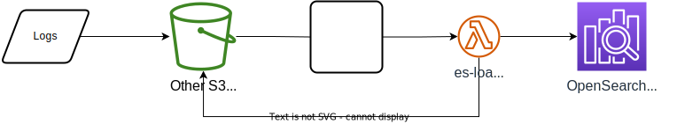
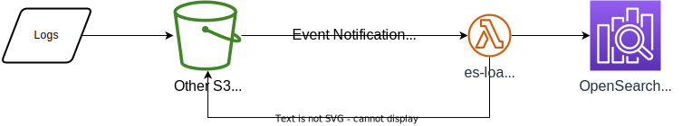
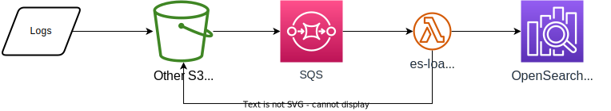
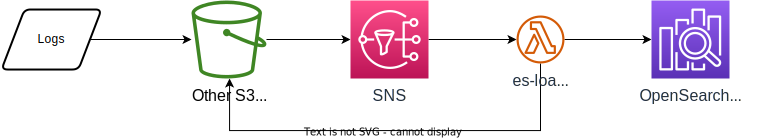

# Changing Configurations of SIEM on Amazon OpenSearch Service

[View this page in Japanese (日本語)](configure_siem_ja.md) | [Chinse (简体中文)](configure_siem_zh-cn.md) | [Back to README](../README.md)

## Table of contents

* [Customizing the log loading method](#customizing-the-log-loading-method)
* [Threat Information Enrichment by IoC](#threat-information-enrichment-by-ioc)
* [Adding an exclusion to log loading](#adding-an-exclusion-to-log-loading)
* [Changing OpenSearch Service configuration settings](#changing-opensearch-service-configuration-settings)
* [Loading Non-AWS services logs](#loading-non-aws-services-logs)
* [Near-real-time loading from other S3 buckets](#near-real-time-loading-from-other-s3-buckets)
* [Loading past data stored in the S3 bucket](#loading-past-data-stored-in-the-s3-bucket)
* [Loading data from SQS Dead Letter Queue](#loading-data-from-sqs-dead-letter-queue)
* [Monitoring](#monitoring)
* [Creating a CloudFormation template](#creating-a-cloudformation-template)

## Customizing the log loading method

You can customize the log loading method into SIEM on OpenSearch Service. A log exported to the S3 bucket is normalized by Lambda function es-loader and loaded into SIEM on OpenSearch Service. The deployed Lambda function is named aes-siem-es-loader. And this Lambda function (es-loader) is triggered by an event notification (All object create events) from the S3 bucket. It then identifies the log type from the file name and the file path to the S3 bucket; extracts the field in a predefined manner for each log type; maps it to [Elastic Common Schema](https://www.elastic.co/guide/en/ecs/current/index.html); and finally loads it into SIEM on OpenSearch Service by specifying the index name.

This process is based on the initial values defined in the configuration file (aws.ini). You may also change them to any values if you want to: export a log to an S3 bucket with a different file path than the initial value; rename the index; or change the index rotation interval, for example. To change the values, you need to create user.ini and define fields and values following the aws.ini structure. The values you set in user.ini are prioritized over those in aws.ini, overwriting the initial values internally.

You can save user.ini either by adding it to a Lambda layer (recommended) or by editing it directly from the AWS Management Console. Note that whenever you update SIEM on OpenSearch Service, the Lambda function is replaced with a new one. While user.ini remains unchanged if you use a Lambda layer (as it is independent from the Lambda function), the file is deleted if edited directly from the AWS Management Console, so you’ll need to create it again.

Note: The configuration file (aws.ini/user.ini) is loaded using configparser from the standard Python3 library. Syntax and other rules follow this library, so even when you find space between words in some set values, just describe them as they are. There is no need to enclose it in double or single quotes. For example, if you define a key with value “This is a sample value”, you should write like this:

(Example of the correct configuration)

```ini
key = This is a sample value
```

(Example of the incorrect configuration)

```ini
key = "This is a sample value"
```

See [this](https://docs.python.org/ja/3/library/configparser.html#module-configparser) for more information on the configparser syntax.

### Adding user.ini to an AWS Lambda layer (recommended)

Create user.ini that has the same structure as that of aws.ini.

Example) Changing the AWS CloudTrail rotation interval from monthly (initial value) to daily.

The initial value of aws.ini is as follows:

```ini
[cloudtrail]
index_rotation = monthly
```

Create user.ini and set the parameter as follows:

```ini
[cloudtrail]
index_rotation = daily
```

Zip the user.ini file so that it can be added to a Lambda layer. Note that user.ini should not contain any directories. The compressed file can have any name (we are naming it configure-es-loader.zip in this example).

```sh
zip -r configure-es-loader.zip user.ini
```

Then create a Lambda layer following the steps below:

1. Log in to the AWS Management Console
1. Navigate to the [AWS Lambda console](https://console.aws.amazon.com/lambda/home)
1. Choose [**Layers**] from the left pane => [**Create layer**] at the top right of the screen
1. Type the following in Layer configuration: Leave the other fields blank.
   * Name: aes-siem-configure-es-loader (any name)
   * Check Upload a .zip file
   * Choose Upload and then select configure-es-loader.zip
   * Compatible runtimes: Choose Python 3.8
1. Choose [**Create**]

Finally, add the Lambda layer that you have just created to Lambda function es-loader:

1. Choose [**Functions**] from the left pane of the Lambda console => Choose [**aes-siem-es-loader**]
1. From [Configuration] tab, choose [**Layers**] in the center of the [Designer] pane.
1. From the [Layers] pane at the bottom of the screen, choose [**Add a layer**]
1. Check Custom layers, and from the drop-down menu of the Custom layers, choose [**aes-siem-configure-es-loader**](or, choose the right one if you gave it a different name) and then choose [**Add**]

Configuration is now complete. You can confirm the addition from the [Layers] pane.

### Editing directly from the AWS Management Console

Alternatively, you can edit user.ini directly from the AWS Management Console to change the configuration.

1. Log in to the AWS Management Console
1. Navigate to the [AWS Lambda console](https://console.aws.amazon.com/lambda/home?)
1. Choose [**Functions**] from the left pane => Choose function [**aes-siem-es-loader**]
1. In the [Function code] pane, a list of files for the Lambda function is displayed. Create user.ini in the root directory and add/edit configuration information
1. Choose the [**Deploy**] button at the top right of the [Function code] pane

Configuration is now complete. Note that Lambda function es-loader will be replaced with a new one and user.ini will be deleted whenever SIEM on OpenSearch Service is updated. In that case, repeat the process above.

## Threat Information Enrichment by IoC

Threat information can be enriched based on IP addresses and domain nams. You can select the following providers as threat information sources for IoC (Indicators of Compromise) during deployment with CloudFormation or CDK.

* [Tor Project](https://www.torproject.org)
* [Abuse.ch Feodo Tracker](https://feodotracker.abuse.ch)
* [AlienVault OTX](https://otx.alienvault.com/)

If there are many IoCs, the processing time of Lambda will increase, so please select IoCs carefully. If you want to use the IoC on AlienVault OTX, please get your API key at [AlienVault OTX](https://otx.alienvault.com/#signup).

You can also use your own IoC. The supported IoC formats are TXT format and SITX 2.x format. IP addresses and CIDR ranges must appear one per line in TXT format.

Upload your own IoC files to to the following location. Replace **_"your provider name"_** with any name. If you do not create the "your provider name" folder, the provider will be named "custom".

TXT format

* s3://aes-siem-**_123456789012_**-geo/IOC/TXT/**_your provider name_**/

STIX 2.x format

* s3://aes-siem-**_123456789012_**-geo/IOC/STIX2/**_your provider name_**/

Since IoC eliminates duplication for each provider, the number of indicators contained in the file does not match the number of indicators actually saved in the database. There is a limit of 5,000 files that can be downloaded and a limit of 128 MB for the created IoC database.

See below for information on the created IoC database.

1. Go to the [Step Functions console](https://console.aws.amazon.com/states/home?)
1. Select state machine **[aes-siem-ioc-state-machine]**
1. Select the latest successful Executions
1. Select its **[Execution output]** in the tab menu
1. You can check the number of IoCs by provider, the number of IoCs by IoC type, and the size of the database

The IoC download and database creation can take up to 24 hours to run for the first time after deployment. If the size is large and the creation of the database fails, after carefully selecting the IoC, delete the cache file `s3://aes-siem-123456789012-geo/IOC/tmp` and execute the Step Functions [ **aes-siem-ioc-state-machine**] manually.

Specify the fields to be enriched in user.ini.

e.g. Enrich based on source.ip and destination.ip in foo log

```conf
[foo]
ioc_ip = source.ip destination.ip
```

e.g.) Enrich based on the ECS field dns.question.name which is a DNS query in bar log

```conf
[bar]
ioc_domain = dns.question.name
```

You can check the enriched information in the following fields.

* threat.matched.providers: Enriched Providers. List format if there are multiple
* threat.matched.indicators: IoC matched values. List format if there are multiple
* threat.enrichments: enriched details. nested format

## Adding an exclusion to log loading

Logs stored in the S3 bucket are automatically loaded into OpenSearch Service, but you can exclude some of them by specifying conditions. This will help save OpenSearch Service resources.

There are two conditions you can specify:

1. S3 bucket storage path (object key)
1. Log field and value

### Adding an exclusion based on the S3 bucket file path (object key)

Whenever CloudTrail or VPC flow logs are output to the S3 bucket, the AWS account ID and region information is added to the logs. You can use this information to add an exclusion to log loading. For example, you can configure not to load logs from your test AWS account.

#### How to add an exclusion

Specify the string of the log you want to exclude in s3_key_ignored in user.ini (aws.ini). The log will not be loaded if it **contains** the string(s) specified there. Strings can be specified using regular expressions. Note that if the string is too short or a generic word, it may also match logs that you don't want to exclude. Also, some AWS resources’ logs specify s3_key_ignored by default, so ensure to check aws.ini first to avoid overwriting the configuration.

##### Example 1) Excluding AWS account 123456789012 from VPC flow logs --> you can simply specify a string

Logs stored in the S3 bucket: s3://aes-siem-123456789012-log/AWSLogs/**000000000000**/vpcflowlogs/ap-northeast-1/2020/12/25/000000000000_vpcflowlogs_ap-northeast-1_fl-1234xxxxyyyyzzzzz_20201225T0000Z_1dba0383.log.gz

Configuration file: user.ini

```ini
[vpcflowlogs]
s3_key_ignored = 000000000000
```

##### Example 2) Excluding AWS accounts 111111111111 and 222222222222 from vpcflowlogs --> since there are more than one string, you can specify them using a regular expression

```ini
[vpcflowlogs]
s3_key_ignored = (111111111111|222222222222)
```

### Excluding logs based on log fields and values

You can exclude logs based on log fields and their values. For example, in VPC flow logs, you can exclude communication from a specific source IP address.

How to add an exclusion:

Upload a CSV file that contains exclusion conditions to the S3 bucket that stores GeoIP (aes-siem-1234567890-**geo** by default.) It should be uploaded to the root path without a prefix.

* CSV file name: [**exclude_log_patterns.csv**]
* Save the CSV file to: [s3://aes-siem-1234567890-**geo**/exclude_log_patterns.csv]
* CSV format: Use the following format, including the header line:

```csv
log_type,field,pattern,pattern_type,comment
```

| Header | Description |
|--------|----|
| log_type | The log section name specified in aws.ini or user.ini. Example) cloudtrail, vpcflowlogs |
| field | The original field name of the raw log. It is not a normalized field. Fields that are hierarchical such as JSON are separated by dots ( **.** ). Example) userIdentity.invokedBy |
| pattern | Specifies the value of the field as a string. Excluded by an **exact match**. Text format and a regular expression can be used. Example) Text format: 192.0.2.10, Regular expression: 192\\.0\\.2\\..* |
| pattern_type | [**regex**] for a regular expression and [**text**] for a string |
| comment | Any string. Does not affect exclusion |

#### Configuration examples

```csv
log_type,field,pattern,pattern_type,comment
vpcflowlogs,srcaddr,192.0.2.10,text,sample1
vpcflowlogs,dstaddr,192\.0\.2\.10[0-9],regex,sample2
cloudtrail,userIdentity.invokedBy,.*\.amazonaws\.com,regex,sample3
```

##### Example 1

This excludes logs where the source IP address (srcaddr) matches 192.0.2.10 in VPC Flow Logs. If pattern_type is text, an exact match is required in the text format. This is to prevent unexpected exclusion of other IP addresses such as 192.0.2.100. Field names won’t be matched or excluded even if you specify normalized field names such as source.ip.

##### Example 2

This excludes logs where the destination IP address (dstaddr) contains string 192.0.2.10. 192.0.2.100 is also excluded as it matches the regular expression. If pattern_type is regex, ensure to escape characters (dot, etc.) that have special meanings in regular expressions.

##### Example 3

This excludes logs that match {'userIdentity': {'invokedBy': '*.amazonaws.com'}} in CloudTrail. Field names are nested, and should be dot-separated in CSV. In this example, logs of API calls invoked by AWS services (such as config or log delivery) are not loaded.

## Changing OpenSearch Service Configuration Settings

You can change the application configurations of OpenSearch Service that are related to SIEM. The following items can be defined for each index.

* Number of replicas of the index, number of shards
* Field mapping, type
* Automatic migration (or deletion) of the index to UltraWarm using Index State Management

While you can configure them freely, some items are pre-configured in SIEM on OpenSearch Service. Please note that there are two setting methods, which differ depending on the version of SIEM on OpenSearch Service.

* [Index templates](https://opensearch.org/docs/latest/opensearch/index-templates/) (SIEM on OpenSearch Service v2.4.1 or later)
* [legacy index templates](https://www.elastic.co/guide/en/elasticsearch/reference/current/indices-templates-v1.html) (SIEM on OpenSearch Service v2.4.0 or prior)

You can check the pre-configured values from [configuration file](../source/lambda/deploy_es/data.ini) or Dev Tools using the commands below:

```http
GET target_index_name/_settings
GET target_index_name/_mapping
```

To add or change a setting, create an index template to save the value. Avoid using a template name that is already in use.

Reserved words for templates in SIEM on OpenSearch Service:

* log\[-aws][-service_name]_aws
* log\[-aws][-service_name]_rollover
* component_template_log\[-aws][-service_name] (SIEM on OpenSearch Service v2.4.1 or later)

If you want to change a pre-configured value, set **priority** of Index templates to 10 or greater, **order** of legacy index templates to 1 or greater to overwrite it.

Example of Configuration:

* Decreasing the number of shards from 3 (default value) to 2 in the CloudTrail index (log-aws-cloudtrail-*) from Dev Tools

Index templates (SIEM on OpenSearch Service v2.4.1 or later)

```http
POST _index_template/log-aws-cloudtrail_mine
{
  "index_patterns": ["log-aws-cloudtrail-*"],
  "priority": 10,
  "composed_of": [
    "component_template_log",
    "component_template_log-aws",
    "component_template_log-aws-cloudtrail"
  ],
  "template": {
    "settings": {
      "number_of_shards": 2
    }
  }
}
```

Legacy index templates (SIEM on OpenSearch Service v2.4.0 or prior)

```http
POST _template/log-aws-cloudtrail_mine
{
  "index_patterns": ["log-aws-cloudtrail-*"],
  "order": 1,
  "settings": {
    "index": {
      "number_of_shards": 2
    }
  }
}
```

## Loading non-AWS services logs

You can load non-AWS services logs into SIEM on OpenSearch Service by exporting logs to the S3 bucket that stores logs. The supported file formats are text, JSON, and CSV formats. In case of text format, only single-line logs can be loaded, and multi-line logs are not supported. You can export logs to S3 using Logstash or Fluentd plug-ins.

Here is the basic configuration flow for Apache HTTP server logs:

1. Define the log you want to load in user.ini

   ```ini
   [apache]
   ```

1. Define the file path, file name, etc. used to export Apache HTTP server access logs to the S3 bucket. You can use regular expressions here. This information is used to determine the log type.

   ```ini
   s3_key = UserLogs/apache/access.*\.log
   ```

1. Specify the file format

   ```ini
   file_format = text
   ```

1. Specify the index name

   ```ini
   index_name = log-web-apache
   ```

1. Define a named capture regular expression to extract fields from logs

   ```ini
   log_pattern = (?P<remotehost>.*) (?P<rfc931>.*) (?P<authuser>.*) \[(?P<datetime>.*?)\] \"(?P<request_method>.*) (?P<request_path>.*)(?P<request_version> HTTP/.*)\" (?P<status>.*) (?P<bytes>.*)
   ```

1. Specify timestamp to tell SIEM on OpenSearch Service the time at which the event occurred. Define the [date format](https://docs.python.org/ja/3/library/datetime.html#strftime-and-strptime-format-codes) as well if it is not compliant with the ISO 8601 format

   ```ini
   timestamp = datetime
   timestamp_format = %d/%b/%Y:%H:%M:%S %z
   ```

1. Specify the fields you want to map to Elastic Common Schema

   ```ini
   # Syntax
   # ecs = ECS_field_name_1 ECS_field_name_2
   # ECS_field_name_1 = original_feed_name_in_the_log
   # ECS_field_name_2 = original_feed_name_in_the_log
   ecs = source.ip user.name http.request.method url.path http.version http.response.status_code http.response.bytes
   source.ip = remotehost
   user.name = authuser
   http.request.method = request_method
   url.path = request_path
   http.version = request_version
   http.response.status_code = status
   http.response.bytes = bytes
   ```

1. Specify the ECS field (which will be used to get country information using GeoIP)

   ```ini
   # The value is either source or destination
   geoip = source
   ```

For more information on configuration items, see aws.ini in es-loader (Lambda function).

If this definition file is not enough to process your logic, you can also add custom logic using a Python script. For example, you can add logic to extract OS or platform information from user-agent. The file name should be sf_logtype.py. In this example, it's named sf_apache.py. If the log type contains - (dash), replace it with _ (underscore). Example) Log type: cloudfront-realtime => File name: sf_cloudfront_realtime.py

Save this file in es-loader's siem directory or in the Lambda layer’s siem directory.

The directory structure inside the zipped file of the Lambda layer should look like this:

```text
|- user.ini
|- siem
    |- sf_apache.py
    |- sf_logtype1.py
    |- sf_logtype2.py
```

Create a zip file and register it to the Lambda layer and you're done

## Near-real-time loading from other S3 buckets



By changing the resource policy of the S3 bucket and notification method, logs from buckets in the same account and in the same region can be loaded into OpenSearch Service.

Follow the Common configuration. Then select one of the following notification methods from "Amazon S3 Event Notifications" etc.

**Do not change the policy of AWS resources created by CDK/CloudFormation. Overwritten by the default policy on SIEM update.**

### Common configuration

Edit the bucket policy for the S3 bucket where the logs are stored so that es-loader can retrieve the logs for the S3 bucket.

1. Get the IAM Role name for es-loader. In IAM Role, search for [**siem-LambdaEsLoaderServiceRole**] and copy the ARN of the IAM Role displayed.
2. Modify the bucket policy referring to the policy example below

```json
{
    "Version": "2012-10-17",
    "Id": "Policy1234567890",
    "Statement": [
        {
            "Sid": "es-loader-to-s3-bucket",
            "Effect": "Allow",
            "Principal": {
                "AWS": "arn:aws:iam::123456789012:role/aes-siem-LambdaEsLoaderServiceRoleXXXXXXXX-XXXXXXXXXXXXX"
            },
            "Action": "s3:GetObject",
            "Resource": [
                "arn:aws:s3:::your-bucket-name/*"
            ]
        }
    ]
}
```

### Amazon S3 Event Notifications



1. Create an event notification in your S3 bucket
    * The following are mandatory fields. Enter other values according to your environment.
    * Check [**All object create events**] for the event type
    * Destination: Select Lambda function
    * Lambda function: Select aes-siem-es-loader
1. [**Save Changes**]

### Amazon SQS



1. Create SQS queue
    * The following are mandatory fields. Enter other values according to your environment
    * Standard type
    * Visibility Timeout: 600 seconds
1. Modify the SQS access policy by referring to the policy example below

    ```json
    {
        "Version": "2008-10-17",
        "Id": "sqs_access_policy",
        "Statement": [
            {
                "Sid": "__owner_statement",
                "Effect": "Allow",
                "Principal": {
                    "AWS": "arn:aws:iam::123456789012:root"
                },
                "Action": "SQS:*",
                "Resource": "arn:aws:sqs:ap-northeast-1:123456789012:your-sqs-name"
            },
            {
                "Sid": "allow-s3bucket-to-send-message",
                "Effect": "Allow",
                "Principal": {
                    "Service": "s3.amazonaws.com"
                },
                "Action": "SQS:SendMessage",
                "Resource": "arn:aws:sqs:ap-northeast-1:123456789012:your-sqs-name",
                "Condition": {
                    "StringEquals": {
                        "aws:SourceAccount": "123456789012"
                    }
                }
            },
            {
                "Sid": "allow-es-loader-to-recieve-message",
                "Effect": "Allow",
                "Principal": {
                    "AWS": "arn:aws:iam::123456789012:role/aes-siem-LambdaEsLoaderServiceRoleXXXXXXXX-XXXXXXXXXXXXX"
                },
                "Action": [
                    "SQS:GetQueueAttributes",
                    "SQS:ChangeMessageVisibility",
                    "SQS:DeleteMessage",
                    "SQS:ReceiveMessage"
                ],
                "Resource": "arn:aws:sqs:ap-northeast-1:123456789012:your-sqs-name"
            }
        ]
    }
    ```

1. From the SQS console, configure a [**Lambda triggers**]
    * select [**aes-siem-es-loader**]
1. Create an event notification in your S3 bucket
    * The following are mandatory fields. Enter other values according to your environment.
    * Check [**All object create events**] for the event type
    * Destination: Select SQS
    * SQS: select the created SQS

### Amazon SNS



1. Create SNS Topic
    * Standard type
1. Modify the SNS access policy by referring to the policy example below

    ```json
    {
        "Version": "2008-10-17",
        "Id": "sns_access_policy",
        "Statement": [
            {
                "Sid": "__default_statement_ID",
                "Effect": "Allow",
                "Principal": {
                    "AWS": "*"
                },
                "Action": [
                    "SNS:GetTopicAttributes",
                    "SNS:SetTopicAttributes",
                    "SNS:AddPermission",
                    "SNS:RemovePermission",
                    "SNS:DeleteTopic",
                    "SNS:Subscribe",
                    "SNS:ListSubscriptionsByTopic",
                    "SNS:Publish"
                ],
                "Resource": "arn:aws:sns:ap-northeast-1:123456789012:your-sns-topic",
                "Condition": {
                    "StringEquals": {
                        "AWS:SourceOwner": "123456789012"
                    }
                }
            },
            {
                "Sid": "Example SNS topic policy",
                "Effect": "Allow",
                "Principal": {
                    "Service": "s3.amazonaws.com"
                },
                "Action": "SNS:Publish",
                "Resource": "arn:aws:sns:ap-northeast-1:123456789012:your-sns-topic",
                "Condition": {
                    "StringEquals": {
                        "aws:SourceAccount": "123456789012"
                    }
                }
            }
        ]
    }
    ```

1. Create a subscription from the SNS console
    * Protocol: AWS Lambda
    * Endpoint: ARN of es-loader
1. Create an event notification in your S3 bucket
    * The following are mandatory fields. Enter other values according to your environment.
    * Check [**All object create events**] for the event type
    * Destination: Select SNS
    * SNS: Select the created SNS

### Amazon EventBridge


1. From the S3 console, turn on Amazon EventBridge for event notifications
1. Create a rule in the EventBridge console
    * Define rule detail: Defaults to Next
    * Build event pattern:
        * Event source: AWS services
        * AWS Service: Simple Storage Service (S3)
        * Event Type: Amazon S3 Event Notification
    * Select target(s):
        * Target type: AWS service
        * Select a target: Lambda Function
        * Function: aes-siem-es-loader
    * Configure tags - optional: Defaults to Next
    * Review and update: Select **Create Rule** to finish

## Loading past data stored in the S3 bucket

You can batch load logs stored in the S3 bucket into OpenSearch Service. Normally, logs are loaded in real time when they are stored in the preconfigured S3 bucket. On the other hand, backed-up data can also be loaded later for visualization or incident investigation purposes. Likewise, you can also load data that failed real-time loading and were trapped into SQS's dead letter queue.

### Setting up the environment

#### Setting up the execution environment for the script (es-loader)

1. Provision an Amazon EC2 instance with an Amazon Linux 2 AMI in a VPC that can communicate with OpenSearch Service
1. Allow HTTP communication from Amazon Linux to GitHub and PyPI websites on the Internet
1. Attach IAM role [**aes-siem-es-loader-for-ec2**] to EC2
1. Connect to the Amazon Linux terminal and follow the steps in [README](../README.md) --> [2. Creating CloudFormation Templates] --> [2-1. Preparation] and [2-2. Cloning SIEM on OpenSearch Service]
1. Install Python modules using the commands below:

   ```python
   cd siem-on-amazon-opensearch-service/source/lambda/es_loader/
   pip3 install -r requirements.txt -U -t .
   pip3 install pandas -U
   ```

#### Setting environment variables

1. Navigate to the Lambda console in the AWS Management Console
1. Navigate to the aes-siem-es-loader function and take a note of the following two environment variable names and values:
   * ES_ENDPOINT
   * GEOIP_BUCKET
1. Paste the environment variables into the Amazon Linux terminal on the EC2 instance. Change the values to suit your environment

   ```sh
   export ES_ENDPOINT=search-aes-siem-XXXXXXXXXXXXXXXXXXXXXXXXXX.ap-northeast-1.es.amazonaws.com
   export GEOIP_BUCKET=aes-siem-123456789012-geo
   ```

### Loading logs from the S3 bucket using an object list

1. Change directory to es_loader

   ```sh
   cd
   cd siem-on-amazon-opensearch-service/source/lambda/es_loader/
   ```

1. Create an object list (s3-list.txt) from the S3 bucket.

   ```sh
   export AWS_ACCOUNT=123456789012   # Replace this with your AWS account
   export LOG_BUCKET=aes-siem-${AWS_ACCOUNT}-log
   aws s3 ls ${LOG_BUCKET} --recursive > s3-list.txt
   ```

1. If necessary, create a limited list of what you want to load

   Example) Creating a list of only CloudTrail logs for 2021

   ```sh
   grep CloudTrail s3-list.txt |grep /2021/ > s3-cloudtrail-2021-list.txt
   ```

1. Load the objects into es-loader using the object list you created in S3

   ```sh
   # Loading all objects in the S3 bucket into es-loader
   ./index.py -b ${LOG_BUCKET} -l s3-list.txt
   # Example of loading extracted objects
   # ./index.py -b ${LOG_BUCKET} -l s3-cloudtrail-2021-list.txt
   ```

1. Review results after the loading is complete. A log file with a list of failed object(s) will be generated if loading fails. If this file does not exist, all objects were loaded successfully
   * Successful object list: S3 list filename.finish.log
   * Failed Object list: S3 list filename.error.log
   * Debug log for failed objects: S3 list filename.error_debug.log
1. You can also load only failed log files by repeating Step 4 and specifying the failed object list in Step 5:

   Example)

   ```sh
   ./index.py -b ${LOG_BUCKET} -l s3-list.error.txt
   ```

1. After the loading succeeds, delete the S3 object list(s) you created as well as the log files generated

## Loading data from SQS Dead Letter Queue

Ingest messages from SQS's dead-letter queue for SIEM (aes-siem-dlq). (The substance is the log on the S3 bucket). We have two methods, one by reredriving the DLQ and another by processing on the EC2 instance.

### Loading with DLQ redrive

1. Navigate to SQS console
1. Select [**aes-siem-dlq**]
1. Select [**Start DLQ redrive**] on the upper right of the screen
1. Transitioned to the screen for Dead-letter queue redrive
     * Check the box [**Redrive to a custom destination**]
     * Select [**aes-siem-sqs-split-logs**] in 'Select an existing queue'
     * Select [**DLQ redrive**] at the bottom right of the screen

Reloading will start.

### Loading with EC2 instance

Use the EC2 instance created in [Loading past data stored in the S3 bucket](#loading-past-data-stored-in-the-s3-bucket)

You can load messages from SQS's dead letter queue for SIEM (aes-siem-dlq). (They are actually logs stored in the S3 bucket)

1. Specify the region and then run es-loader

   ```sh
   export AWS_DEFAULT_REGION=ap-northeast-1
   cd
   cd siem-on-amazon-opensearch-service/source/lambda/es_loader/
   ./index.py -q aes-siem-dlq
   ```

1. Review results after the loading is complete. A log file with a list of failed object(s) will be generated if loading fails. If this file does not exist, all objects were loaded successfully
   * Successful object list: aes-siem-dlq-date.finish.log
   * Failed object list: aes-siem-dlq-date.error.log
   * Debug logs for failed objects: aes-siem-dlq-date.error_debug.log

1. Since the failed object list is an object list for S3, you can load only failed logs by specifying the list when rerunning the command mentioned in the previous section
1. Delete the generated log files after the loading succeeds

## Monitoring

### OpenSearch Index Metrics

For optimal OpenSearch performance, you need to tune the index rotation interval and shard count to get the right number of shards and shard size. You can check how many shards you currently have and whether any shards are too large from the OpenSearch Service dashboard.

Dashboard Name on OpenSaerch Dashboards: OpenSearch Metrics [Sample](./dashboard.md#Amazon-OpenSearch-Service-Metrics)

The data source is saved to the S3 bucket for logs at `/AWSLogs/123456789012/OpenSearch/metrics/` by running the Lambda Function aes-siem-index-metrics-exporter once an hour.

Reference: [Amazon OpenSearch Service Operational Best Practices](https://docs.aws.amazon.com/opensearch-service/latest/developerguide/bp.html)

### CloudWatch Dashboard

You can check the metrics and error logs of the key AWS resources that make up the SIEM. It can be used for performance tuning of Indexing and Search in OpenSearch Service, and for troubleshooting.

Custom Dashboard Name on CloudWatch Dashboard: [SIEM](https://console.aws.amazon.com/cloudwatch/home?#dashboards:name=SIEM)

### CloudWatch Metrics

You can view the metrics of es-loader, which normalizes logs and sends data to OpenSearch Service, in CloudWatch Metrics.

* Custom namespace: SIEM
* Dimension: logtype

| Metric | Unit | Description |
|------|-------|-----|
| InputLogFileSize | Byte | Log file size that es-loader loaded from the S3 bucket |
| OutputDataSize | Byte | Size of the data that es-loader sent to OpenSearch Service |
| SuccessLogLoadCount | Count | The number of logs for which es-loader successfully sent data to OpenSearch Service |
| ErrorLogLoadCount | Count | The number of logs for which es-loader failed to send data to OpenSearch Service |
| TotalDurationTime | Millisecond | The amount of time between when es-loader started processing and when all processing was completed. Approximately the same as Lambda Duration |
| EsResponseTime | Millisecond | The amount of time it took for es-loader to send data to OpenSearch Service and complete processing |
| TotalLogFileCount | Count | The number of log files processed by es-loader |
| TotalLogCount | Count | The number of logs targeted for processing from the logs contained in the log files. This includes logs that were not actually loaded due to filtering |

### CloudWatch Logs

You can check the logs of the Lambda functions used for SIEM in CloudWatch Logs.
The es-loader logs are output in the JSON format, so you can filter and search them in CloudWatch Logs Insights.

| Field | Description |
|-----|------|
| level | The severity of the log. By default, only “info” or higher messages are logged. In case of trouble, you can temporarily log “debug” level messages by changing LOG_LEVEL (an aes-siem-es-loader environment variable) to “debug”. Because logging debug messages generates a lot of log files, we recommend that you revert LOG_LEVEL to “info” after investigation |
| s3_key | Object key for the log files stored in the S3 bucket. After processing the target log files, you can use s3_key as the search key to extract the processing logs and the raw data of the above metrics to confirm |
| message | Message in the log. In some cases, it’s in the JSON format |

AWS Lambda Powertools Python is used for the other fields. For more information, see the [AWS Lambda Powertools Python](https://awslabs.github.io/aws-lambda-powertools-python/core/metrics/) documentation.

## Creating a CloudFormation template

You can skip this if you have already deployed SIEM on OpenSearch Service using one of the CloudFormation templates in Step 1 above.

### 1. Prerequisites

The following instance and tools need to be in place so that you can create a CloudFormation template:

* AWS CloudShell or Amazon EC2 instance running Amazon Linux 2
  * "Development Tools"
  * Python 3.8
  * Python 3.8 libraries and header files
  * Git

Run the following commands if the above tools have not been installed yet:

```shell
sudo yum groups mark install -y "Development Tools"
sudo yum install -y amazon-linux-extras
sudo amazon-linux-extras enable python3.8
sudo yum install -y python38 python38-devel git jq
sudo update-alternatives --install /usr/bin/python3 python3 /usr/bin/python3.8 1
```

### 2. Cloning SIEM on OpenSearch Service

Clone SIEM on OpenSearch Service from our GitHub repository:

```shell
cd
git clone https://github.com/aws-samples/siem-on-amazon-opensearch-service.git
```

### 3. Setting up the enviroment variables

```shell
export TEMPLATE_OUTPUT_BUCKET=<YOUR_TEMPLATE_OUTPUT_BUCKET> # Name of the S3 bucket where the template is loaded
export AWS_REGION=<AWS_REGION> # Region where the distribution is deployed
```

> **_Note:_** $TEMPLATE_OUTPUT_BUCKET indicates an S3 bucket name, so create yours beforehand. This bucket will be used to store files distributed for deployment, so it needs to be publicly accessible. The build-s3-dist.sh script (used to create a template) WILL NOT create any S3 bucket.

### 4. Packaging AWS Lambda functions and creating a template

```shell
cd ~/siem-on-amazon-opensearch-service/deployment/cdk-solution-helper/
chmod +x ./step1-build-lambda-pkg.sh && ./step1-build-lambda-pkg.sh && cd ..
chmod +x ./build-s3-dist.sh && ./build-s3-dist.sh $TEMPLATE_OUTPUT_BUCKET
```

### 5. Uploading the deployment assets to your Amazon S3 bucket

```shell
aws s3 cp ./global-s3-assets s3://$TEMPLATE_OUTPUT_BUCKET/ --recursive --acl bucket-owner-full-control
aws s3 cp ./regional-s3-assets s3://$TEMPLATE_OUTPUT_BUCKET/ --recursive --acl bucket-owner-full-control
```

> **_Note:_** To run the commands, you'll need to grant permissions to upload files to the S3 bucket. Also ensure to set the right access policy to the files once they are uploaded.

### 6. Deploying SIEM on OpenSearch Service

The uploaded template is now stored in `https://s3.amazonaws.com/$TEMPLATE_OUTPUT_BUCKET/siem-on-amazon-opensearch-service.template`. Deploy this template using AWS CloudFormation.

[Back to README](../README.md)
